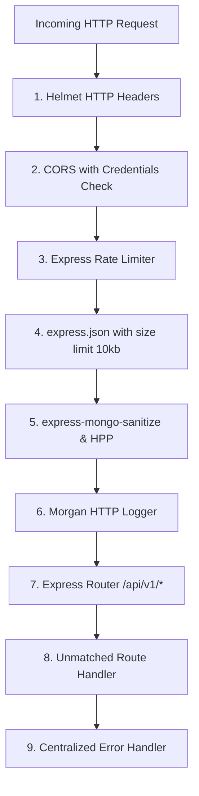
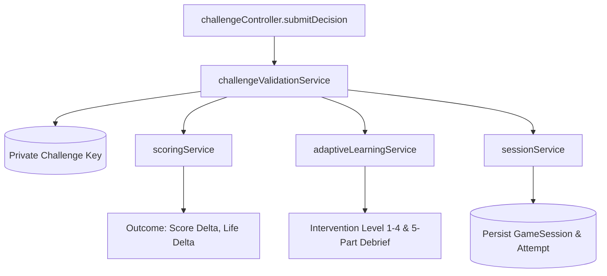
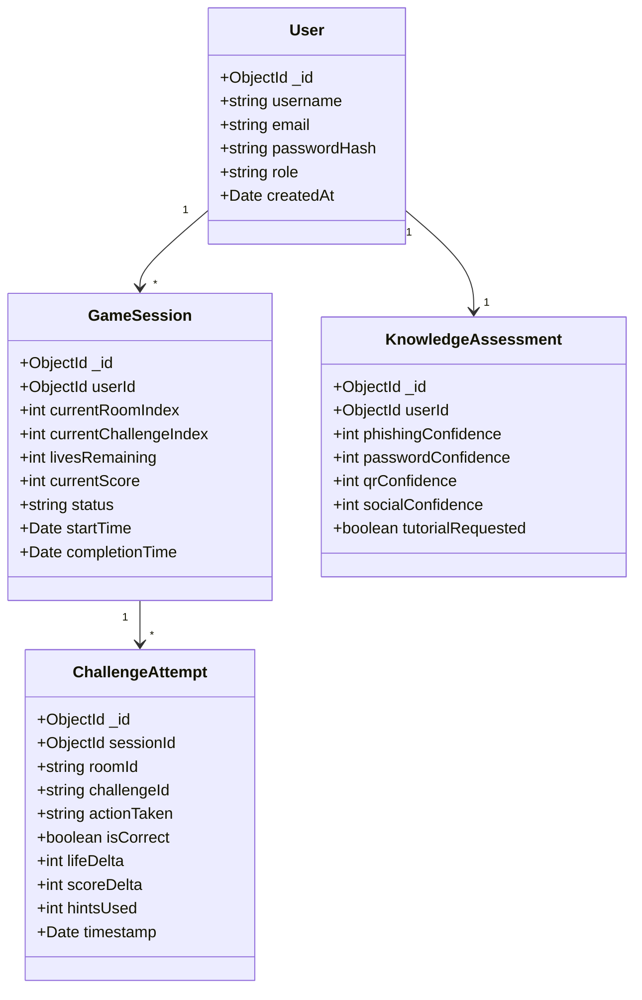

# BACKEND ARCHITECTURE
## Digital Safety Escape Room

---

### 1. Backend Structure

The backend is an authoritative, secure REST API server built with **Node.js**, **Express.js**, and **MongoDB / Mongoose**. It follows an enterprise layered architecture (Controllers $\to$ Services $\to$ Data Models) separating HTTP transport, domain logic, and persistence.

```
/backend
├── src/
│   ├── config/                    # Environment variables, database, security options
│   │   ├── db.js                  # Mongoose connection with retry & pooling
│   │   ├── env.js                 # Environment variable validation via Zod
│   │   └── security.js            # Helmet, CORS, and rate-limiting options
│   ├── controllers/               # HTTP request handlers (thin adapters)
│   │   ├── authController.js      # Register, login, refresh, logout, profile
│   │   ├── assessmentController.js# Baseline assessment submission and retrieval
│   │   ├── sessionController.js   # Session lifecycle (start, get, abandon)
│   │   ├── roomController.js      # Room metadata delivery (sanitized)
│   │   ├── challengeController.js # Challenge submission, hints, validation
│   │   ├── dashboardController.js # User stats, runs history, badge shelf
│   │   ├── leaderboardController.js# Verified public leaderboard rankings
│   │   └── reportController.js    # Performance analysis & debrief generation
│   ├── data/                      # Authoritative private challenge definitions
│   │   ├── challenges/
│   │   │   ├── room01.inbox.js    # Phishing datasets, header keys, IoCs
│   │   │   ├── room02.vault.js    # Password entropy thresholds, MFA rules
│   │   │   ├── room03.scanner.js  # QR payload decoders, malicious redirect keys
│   │   │   ├── room04.message.js  # Social engineering pretext keys, directory records
│   │   │   └── room05.control.js  # Multi-threat incident containment matrix
│   │   └── achievements.js        # Achievement criteria and metadata definitions
│   ├── middleware/                # Express middleware pipeline
│   │   ├── authMiddleware.js      # JWT verification & req.user attachment
│   │   ├── sessionGuard.js        # Active session & IDOR ownership verification
│   │   ├── validateRequest.js     # Zod schema request body/param validator
│   │   ├── rateLimiter.js         # Endpoint-specific rate limiting
│   │   └── errorHandler.js        # Centralized operational error envelope
│   ├── models/                    # Mongoose schemas
│   │   ├── User.js                # Player accounts and credentials
│   │   ├── KnowledgeAssessment.js # Baseline security confidence profile
│   │   ├── GameSession.js         # Authoritative game session state
│   │   ├── ChallengeAttempt.js    # Audit log of every decision and consequence
│   │   ├── Achievement.js         # Earned player badges
│   │   └── LeaderboardEntry.js    # Indexed records for fast ranking queries
│   ├── routes/                    # Versioned REST API routers
│   │   ├── index.js               # Router aggregator mounting at /api/v1
│   │   ├── authRoutes.js          # /auth/*
│   │   ├── assessmentRoutes.js    # /assessment/*
│   │   ├── sessionRoutes.js       # /session/*
│   │   ├── roomRoutes.js          # /rooms/*
│   │   ├── challengeRoutes.js     # /challenges/*
│   │   ├── dashboardRoutes.js     # /dashboard/*
│   │   └── leaderboardRoutes.js   # /leaderboard/*
│   ├── services/                  # Authoritative domain business logic
│   │   ├── authService.js         # Password hashing, token generation
│   │   ├── sessionService.js      # State machine transitions and locks
│   │   ├── challengeValidationService.js # Compares actions to secret keys
│   │   ├── scoringService.js      # Deterministic score & life calculations
│   │   ├── adaptiveLearningService.js    # Evaluates mistake patterns & interventions
│   │   ├── performanceReportService.js   # Computes topic mastery & diagnostics
│   │   ├── achievementService.js  # Evaluates criteria and awards badges
│   │   └── leaderboardService.js  # Compiles verified leaderboard standings
│   ├── utils/                     # Utility helpers
│   │   ├── AppError.js            # Custom operational error class
│   │   ├── logger.js              # Winston structured logging
│   │   └── constants.js           # Score baselines, penalty values, life limits
│   ├── app.js                     # Express application configuration & pipeline
│   └── server.js                  # HTTP server listener and cluster lifecycle
├── tests/
│   ├── unit/                      # Scoring, validation, and adaptive rules tests
│   └── integration/               # Supertest API endpoint lifecycle tests
├── .env.example
└── package.json
```

---

### 2. Express Application Pipeline (`app.js`)

The Express application pipeline enforces strict defensive security ordering:



---

### 3. REST API Routes Catalog

All endpoints are prefixed by `/api/v1`:

| HTTP Verb | Path | Auth Required | Description |
| :--- | :--- | :--- | :--- |
| `POST` | `/auth/register` | No | Create player account with bcrypt password |
| `POST` | `/auth/login` | No | Authenticate; sets HttpOnly refresh cookie; returns access token |
| `POST` | `/auth/refresh` | No | Exchange valid refresh cookie for new access token |
| `POST` | `/auth/logout` | Yes | Clear refresh cookie |
| `GET` | `/auth/me` | Yes | Fetch authenticated user profile |
| `POST` | `/assessment` | Yes | Submit 4-topic baseline confidence ratings |
| `GET` | `/assessment` | Yes | Fetch user baseline profile |
| `POST` | `/session/start` | Yes | Initialize a new escape room session |
| `GET` | `/session/active` | Yes | Retrieve active in-progress session state |
| `POST` | `/session/abandon` | Yes | Terminate active in-progress session |
| `GET` | `/rooms/:roomId` | Yes | Get sanitized room data and current challenge |
| `POST` | `/challenges/:id/submit`| Yes | Authoritatively validate decision payload |
| `POST` | `/challenges/:id/hint` | Yes | Request hint (logs audit and applies penalty) |
| `GET` | `/reports/:sessionId` | Yes | Generate detailed Cybersecurity Performance Report |
| `GET` | `/dashboard/summary` | Yes | Fetch player career runs and earned achievements |
| `GET` | `/leaderboard` | No | Fetch verified top escape rankings |

---

### 4. Controller Layer (`/src/controllers`)

Controllers act purely as HTTP boundary adapters:
1. Extract and validate parameters from `req.body`, `req.params`, and `req.query`.
2. Delegate business logic execution to corresponding services.
3. Formulate standard HTTP response envelopes `{ success: true, data: ... }`.
4. Forward asynchronous exceptions to `next(error)`.

---

### 5. Service Layer (`/src/services`)

The service layer contains 100% of the game logic and enforces server authority:



* **`challengeValidationService`**: Evaluates player actions against hidden threat models.
* **`scoringService`**: Computes point increments, difficulty multipliers, and penalties.
* **`adaptiveLearningService`**: Monitors failure patterns and selects appropriate interventions.
* **`performanceReportService`**: Analyzes historical attempts to calculate topic percentages, strongest skills, and personalized remediation advice.
* **`achievementService`**: Inspects completed session metrics and persists earned badges.

---

### 6. Mongoose Data Models & Indexes



#### Strategic Database Indexes
* `User.email`: Unique index (`{ email: 1 }`).
* `User.username`: Unique index (`{ username: 1 }`).
* `GameSession`: Compound index for rapid active session lookup: `{ userId: 1, status: 1 }`.
* `ChallengeAttempt`: Compound index for session audits: `{ sessionId: 1, challengeId: 1 }`.
* `LeaderboardEntry`: Compound index for lightning-fast leaderboard pagination: `{ finalScore: -1, totalDurationSeconds: 1 }`.

---

### 7. Middleware Specifications

* **`authMiddleware`**: Verifies the `Authorization: Bearer <token>` header against `JWT_SECRET`. Attaches decoded payload to `req.user`.
* **`sessionGuard`**: Verifies that the requested `sessionId` exists, belongs to `req.user.id`, and has `status === 'IN_PROGRESS'`.
* **`validateRequest(schema)`**: Middleware factory taking a Zod schema and validating `req.body`, returning a 400 Bad Request with field errors if validation fails.
* **`errorHandler`**: Global catch-all middleware mapping `AppError` instances to standardized JSON envelopes while sanitizing stack traces in production.

---

### 8. Validation Strategy (Zod Schemas)

All request payloads are strictly validated before hitting business logic:

```javascript
// Validation Schema for Challenge Action Submission
export const submitChallengeSchema = z.object({
  body: z.object({
    sessionId: z.string().regex(/^[0-9a-fA-F]{24}$/, "Invalid Session ObjectId"),
    actionId: z.string().min(1, "Action identifier is required"),
    inspectedArtifacts: z.array(z.string()).default([]),
    timeElapsedSeconds: z.number().nonnegative()
  })
});
```

---

### 9. Authentication Security Implementation

* **Bcrypt Hashing**: Passwords hashed with `bcryptjs.hash(password, 12)`.
* **Dual-Token Scheme**:
  * Access Token: 15-minute expiration, signed with HMAC-SHA256 (`JWT_SECRET`).
  * Refresh Token: 7-day expiration, signed with `JWT_REFRESH_SECRET`, stored in an `HttpOnly` cookie with `SameSite: 'Strict'` and `Secure: true` in production.
* **Timing Attack Mitigation**: When authenticating, fake password verification is executed even if the email is not found, preventing user enumeration via timing discrepancies.

---

### 10. Authorization & IDOR Protection

All stateful operations enforce object ownership:
```javascript
// Verification within sessionService
const session = await GameSession.findById(sessionId);
if (!session) {
  throw new AppError("Game session not found", 404);
}
if (session.userId.toString() !== userId) {
  throw new AppError("Forbidden: You do not own this game session", 403);
}
if (session.status !== 'IN_PROGRESS') {
  throw new AppError("Session is locked. Status: " + session.status, 409);
}
```

---

### 11. Game Session State Machine

```
NOT_STARTED ──(startSession)──> IN_PROGRESS
IN_PROGRESS ──(lives == 0)───> FAILED (Containment Breach)
IN_PROGRESS ──(abandon)──────> ABANDONED
IN_PROGRESS ──(room 5 clear)─> COMPLETED (Escape Success)
```

Transitions are atomic. When `livesRemaining === 0`, `session.status` is committed as `FAILED`, immediately barring any subsequent submissions.

---

### 12. Challenge Validation Logic (Server-Authoritative)

The frontend transmits only user actions, never outcomes:
* **Client Payload**: `{ sessionId, actionId: "FLAG_PHISHING", inspectedArtifacts: ["header_return_path"] }`
* **Server Logic**:
  1. Retrieve authoritative challenge specification from `/src/data/challenges/`.
  2. Check if `actionId === challenge.correctActionId`.
  3. Verify whether critical IoC artifacts were inspected (granting potential investigation bonuses).
  4. Deduct lives and score if incorrect.
  5. Assemble the authoritative 5-part explanation payload.
* **Answer Secrecy**: The solution key is never exposed via any API route.

---

### 13. Authoritative Scoring Algorithm

```javascript
function calculateScore({ basePoints, difficulty, timeElapsed, targetTime, hintCount, mistakeCount }) {
  const diffMultiplier = { beginner: 1.0, intermediate: 1.25, advanced: 1.5, expert: 2.0 }[difficulty] || 1.0;
  const timeBonus = Math.max(0, Math.min(200, (targetTime - timeElapsed) * 2));
  const hintDeduction = hintCount * 75;
  const mistakeDeduction = mistakeCount * 150;
  
  const rawScore = (basePoints * diffMultiplier) + timeBonus - hintDeduction - mistakeDeduction;
  return Math.max(50, Math.round(rawScore)); // Minimum floor of 50 points upon success
}
```

---

### 14. Authoritative Life Handling

* Initial session state: `livesRemaining: 3`.
* On incorrect submission:
  * Decrement: `session.livesRemaining -= 1`.
  * If `session.livesRemaining <= 0`:
    * `session.status = 'FAILED'`.
    * `session.completionTime = new Date()`.
    * Response includes `{ gameOver: true, reason: 'LOCKDOWN_BREACH' }`.
  * Save atomically using MongoDB conditional update (`$inc: { livesRemaining: -1 }`).

---

### 15. Sequential Progression Logic

* Challenge progression is validated against sector manifests.
* If a user attempts to access Room 03 while Room 02 challenges remain uncompleted in `ChallengeAttempt`, the request is rejected with `HTTP 403: "Sector 02 remains compromised. Clearance denied."`

---

### 16. Adaptive Learning Engine Implementation

The engine evaluates signals stored across the active session:

```javascript
function determineInterventionLevel({ topic, historicalMistakesInTopic, selfConfidenceRating }) {
  if (historicalMistakesInTopic === 0) {
    return { level: 1, type: 'NONE' };
  }
  if (historicalMistakesInTopic === 1) {
    return { level: 2, type: 'CONTEXTUAL_EXPLANATION' };
  }
  if (historicalMistakesInTopic === 2 || (historicalMistakesInTopic === 1 && selfConfidenceRating <= 2)) {
    return { level: 3, type: 'MICRO_TUTORIAL' };
  }
  return { level: 4, type: 'GUIDED_RETRY' };
}
```

---

### 17. Knowledge Assessment Storage & Profiling

Stored in `KnowledgeAssessment`:
* `phishingConfidence`: 1 to 5
* `passwordConfidence`: 1 to 5
* `qrConfidence`: 1 to 5
* `socialConfidence`: 1 to 5
* `tutorialRequested`: Boolean

This baseline establishes the player's initial learning profile and serves as the benchmark against which actual room performance is contrasted.

---

### 18. Cybersecurity Performance Report Calculations

Upon successful escape, `performanceReportService.generateReport(sessionId)` calculates:
1. **Topic Mastery %**:
   $$\text{Mastery}_{\text{topic}} = \frac{\text{Successful Decisions in Topic}}{\text{Total Actions in Topic}} \times 100$$
2. **Strongest Skill**: Topic with highest mastery and lowest hint usage.
3. **Weakest Skill / Primary Vulnerability**: Topic with lowest accuracy or highest life losses.
4. **Personalized Recommendation**: Curated actionable takeaway addressing the identified weakness.

---

### 19. Achievement & Badge Logic

Triggered automatically upon session completion:
* **Cyber Guardian**: `session.status === 'COMPLETED'`.
* **Zero Mistake Escape**: `session.status === 'COMPLETED' && session.livesRemaining === 3`.
* **Phishing Expert**: `room01Accuracy === 100% && room01Hints === 0`.
* **QR Detective**: Identified all malicious QR codes in Room 03 with zero errors.
* **Social Engineering Shield**: Resisted all urgency pretexts in Room 04.

---

### 20. Leaderboard Verification & Queries

* **Strict Filtering**: Only sessions where `status === 'COMPLETED'` are eligible.
* **Anti-Manipulation Query**:
  ```javascript
  const topEscapes = await LeaderboardEntry.find()
    .sort({ finalScore: -1, totalDurationSeconds: 1 })
    .limit(50)
    .populate('userId', 'username');
  ```

---

### 21. Error Handling Architecture

A custom `AppError` class standardizes operational exceptions:

```javascript
export class AppError extends Error {
  constructor(message, statusCode, code = 'OPERATIONAL_ERROR', details = null) {
    super(message);
    this.statusCode = statusCode;
    this.code = code;
    this.details = details;
    this.isOperational = true;
    Error.captureStackTrace(this, this.constructor);
  }
}
```

The global error middleware intercepts all errors:
* Operational errors return status code, code, and user-safe message.
* Programming bugs (syntax errors, DB disconnects) return generic HTTP 500 in production, logging the full stack trace securely to Winston.

---

### 22. Logging & Audit Architecture (Winston)

* **Transport 1**: Console with colorized output for local development.
* **Transport 2**: Daily rotating JSON file `logs/security.log` tracking:
  * Failed login attempts.
  * Rapid challenge submission spikes (potential automated bots).
  * Unauthorized IDOR attempts.
  * Life deduction and score mutation events.

---

### 23. Security Controls

* **NoSQL Injection Defense**: `express-mongo-sanitize` strips keys containing `$` or `.` from request payloads.
* **HTTP Parameter Pollution**: `hpp` middleware prevents parameter pollution attacks.
* **Helmet**: Sets secure HTTP response headers (`Content-Security-Policy`, `X-Content-Type-Options: nosniff`).
* **CORS Whitelist**: Strictly bound to client host with `credentials: true`.

---

### 24. Rate Limiting Strategy

Configured via `express-rate-limit`:
* Global: 120 req/min per IP.
* Auth Routes (`/api/v1/auth/*`): 5 req/15min per IP.
* Challenge Submission (`/api/v1/challenges/*/submit`): 30 req/min per active session.

---

### 25. Trusted Server State vs Untrusted UI State

| State Element | Trusted Server State | Untrusted Client UI State |
| :--- | :--- | :--- |
| **Score** | Stored in MongoDB; calculated via formula | Merely displays animated counter |
| **Lives Remaining**| Decremented on DB; evaluated for Game Over | Merely renders heart icons |
| **Current Room** | Stored in Session; validated via prerequisites | Merely navigates view to match |
| **Correctness** | Evaluated against private answer keys | Merely receives boolean outcome |
| **Active Challenge**| Filtered payload sent to client | Renders form controls |

---

### 26. Backend Testing Strategy

* **Unit Tests**:
  * `scoringService.test.js`: Validates all scoring formulas, hint penalties, and minimum score floors.
  * `adaptiveLearningService.test.js`: Confirms intervention level escalations across edge-case mistake frequencies.
  * `challengeValidation.test.js`: Asserts that all 5 room challenge keys validate correctly against mock user inputs.
* **Integration Tests (Supertest)**:
  * Full session lifecycle tests ensuring that game integrity cannot be bypassed via direct API calls or out-of-order room submissions.
