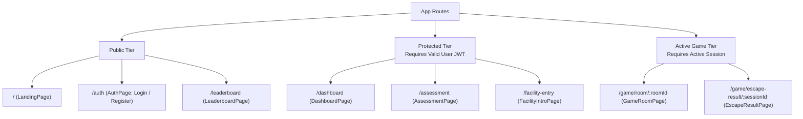
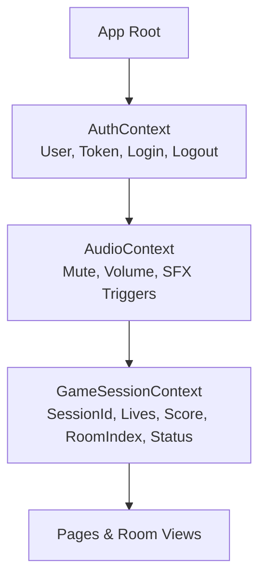

# FRONTEND ARCHITECTURE
## Digital Safety Escape Room

---

### 1. Frontend Structure

The frontend is a modern single-page application built with **React 18/19**, **Vite**, **Tailwind CSS**, and **Framer Motion**. It follows a feature-driven, modular architecture designed for high maintainability, code-splitting, and extensibility.

```
/frontend
├── public/
│   ├── audio/                     # Sound effects (alarms, chimes, clicks)
│   ├── images/                    # Evidence textures, badges, logos
│   └── favicon.ico
├── src/
│   ├── assets/                    # Bundled SVGs, fonts, and stylesheets
│   ├── components/
│   │   ├── common/                # Reusable UI primitives (Button, Modal, etc.)
│   │   ├── feedback/              # Toast, alerts, skeleton loaders
│   │   └── layout/                # MainLayout, GameLayout, AuthLayout
│   ├── context/
│   │   ├── AuthContext.jsx        # Authentication and user credentials state
│   │   ├── GameSessionContext.jsx # Game session, lives, score, and room state
│   │   └── AudioContext.jsx       # Sound effects and ambient audio toggle
│   ├── features/
│   │   ├── assessment/            # Knowledge assessment survey & profiling
│   │   ├── dashboard/             # Player hub, career history, trophy shelf
│   │   ├── leaderboard/           # Global rankings and run inspector
│   │   ├── learning/              # 5-part debrief modal, micro-tutorials
│   │   └── rooms/                 # Escape room implementations
│   │       ├── RoomContainer.jsx  # Generic room wrapper & dynamic loader
│   │       ├── components/        # HUD, Evidence Dock, Decision Dock
│   │       ├── room-01-inbox/     # Phishing evidence viewer & tools
│   │       ├── room-02-vault/     # Password analysis & MFA controls
│   │       ├── room-03-scanner/   # QR decoder lens & destination inspector
│   │       ├── room-04-message/   # Social chat inspector & directory lookup
│   │       └── room-05-control/   # Multi-threat incident triage matrix
│   ├── hooks/
│   │   ├── useAuth.js             # Auth context consumer
│   │   ├── useGameSession.js      # Session context consumer
│   │   ├── useSound.js            # Synthesized & sample-based audio trigger
│   │   └── useReducedMotion.js    # Accessibility motion preference detector
│   ├── pages/
│   │   ├── LandingPage.jsx        # Atmospheric public entry
│   │   ├── AuthPage.jsx           # Terminal login and registration
│   │   ├── AssessmentPage.jsx     # Pre-game baseline assessment
│   │   ├── FacilityIntroPage.jsx  # Cinematic lockdown breach intro
│   │   ├── GameRoomPage.jsx       # Primary game viewport mounting RoomContainer
│   │   ├── EscapeResultPage.jsx   # Victory report and diagnostic radar
│   │   ├── DashboardPage.jsx      # Persistent player hub
│   │   ├── LeaderboardPage.jsx    # Public verified rankings
│   │   └── NotFoundPage.jsx       # 404 terminal diagnostic
│   ├── routes/
│   │   ├── AppRoutes.jsx          # Route tree definitions
│   │   ├── ProtectedRoute.jsx     # Auth verification guard
│   │   └── GameGuard.jsx          # Active session and prerequisite guard
│   ├── services/
│   │   ├── api.js                 # Axios instance with interceptors
│   │   ├── authService.js         # Auth API calls
│   │   ├── sessionService.js      # Game session management API
│   │   └── challengeService.js    # Challenge submission & hint API
│   ├── types/                     # TypeScript / JSDoc type contracts
│   ├── utils/
│   │   ├── domPurify.js           # XSS sanitizer for simulated evidence
│   │   ├── soundEngine.js         # Web Audio API synthesizer fallback
│   │   └── formatters.js          # Time and score formatting helpers
│   ├── App.jsx                    # Root provider composition
│   ├── main.jsx                   # React entry point
│   └── index.css                  # Tailwind styles and terminal theme tokens
├── index.html
├── package.json
├── tailwind.config.js
└── vite.config.js
```

---

### 2. Route Architecture

Routes are organized into public, authentication, and protected gameplay tiers using React Router:



#### Route Guard Specifications
* `ProtectedRoute`: Checks `AuthContext.isAuthenticated`. If false, redirects to `/auth` with return URL state.
* `AssessmentGuard`: Verifies that the player has completed their initial baseline assessment before entering gameplay routes.
* `GameGuard`: Validates that an active `GameSession` exists with status `IN_PROGRESS`. Redirects to `/dashboard` or `/assessment` if no active session is found.

---

### 3. Page Architecture

Each top-level page component is responsible for orchestrating layouts and connecting feature containers:

1. **`LandingPage`**: Public showcase, teaser trailer animation, feature cards, and CTA to enter the facility.
2. **`AuthPage`**: Tabbed terminal login and account creation with instant validation.
3. **`AssessmentPage`**: 4-topic slider survey, optional tutorial toggle, and clearance submission.
4. **`FacilityIntroPage`**: Narrative cinematic with emergency beacon animation and simulated lockdown alert sequence.
5. **`GameRoomPage`**: Mounts `GameLayout`, `GameHeader`, `RoomContainer`, and `ConsequenceModal`.
6. **`EscapeResultPage`**: Displays victory cinematic, score breakdown, skill radar chart, and badge showcases.
7. **`DashboardPage`**: Player profile summary, continue game button, career playthrough table, and trophy shelf.
8. **`LeaderboardPage`**: Searchable and filterable table of top escape records.

---

### 4. Component Architecture & Design System

The application uses an atomic and feature-driven component composition:

```
Atoms (Primitives)      -> Button, Badge, TerminalText, Icon, Tooltip
Molecules (Composites)  -> HeartIndicator, ScoreBadge, UrlInspector, EvidenceHeader
Organisms (Features)    -> EmailViewer, VaultKeypad, QRLens, SocialChat, ConsequenceModal
Templates (Layouts)     -> GameLayout, DashboardLayout, AuthLayout
Pages                   -> GameRoomPage, EscapeResultPage, DashboardPage
```

---

### 5. Shared UI Primitives (`/src/components/common`)

* **`TerminalButton`**: Styled button supporting variants (`primary`, `danger`, `warning`, `ghost`) with scanline hover animations, audio click trigger, and loading spinner.
* **`TerminalCard`**: Dark slate container with glowing neon border accents, corner crosshairs, and optional header bar.
* **`TerminalModal`**: Accessible dialog rendered via React Portal with background blur, focus trap, and keyboard `Escape` listener.
* **`TerminalText`**: Monospaced text component with optional typewriter typing effect and customizable blinking cursor.
* **`StatusBadge`**: Pill badge indicating security levels (`CRITICAL`, `ELEVATED`, `SECURE`).

---

### 6. Game-Shell Architecture (`/src/features/rooms/components`)

The game shell maintains persistent gameplay state and situational awareness:

```
┌────────────────────────────────────────────────────────────────────────┐
│ GameHeader (HUD)                                                       │
│ [Sector Minimap]   [♥ ♥ ♥ Lives]   [Score: 01450]   [Timer]   [Hint]   │
├────────────────────────────────────────────────────────────────────────┤
│ GameStage (Dynamic Viewport)                                           │
│                                                                        │
│   RoomContainer (Loads Room 01 - 05 via Suspense)                      │
│   ├── Sector Title & Narrative Mission Objective                       │
│   ├── Primary Evidence Inspection Stage                                │
│   └── Tactical Decision Console                                        │
│                                                                        │
├────────────────────────────────────────────────────────────────────────┤
│ Global Overlays (Rendered conditionally via Portal)                    │
│ - ConsequenceModal (Alarm flash, glitch effect, life deduction)         │
│ - LearningInterventionDrawer (5-part debrief or micro-tutorial)        │
│ - HintConfirmationModal (Deduction warning and progressive clue)       │
└────────────────────────────────────────────────────────────────────────┘
```

---

### 7. Extensible Room Architecture

To ensure new rooms can be added without modifying the game shell, room components conform to a standardized contract (documented via JSDoc):

```javascript
/**
 * @typedef {Object} RoomProps
 * @property {Object} roomMetadata
 * @property {string} roomMetadata.id - e.g., 'room-01-inbox'
 * @property {number} roomMetadata.sectorNumber - 1-indexed (1 to 5)
 * @property {string} roomMetadata.title - e.g., 'The Inbox'
 * @property {'phishing'|'password_security'|'qr_security'|'social_engineering'|'multi_threat'} roomMetadata.topic
 * @property {Object} challengeData - Active sanitized challenge payload from server
 * @property {function(string, Object=): Promise<void>} onDecisionSubmit - Dispatches actionId to server
 * @property {function(): Promise<void>} onRequestHint - Requests hint with score deduction
 * @property {boolean} isSubmitting - Loading indicator state during server validation
 */
```

The `RoomContainer` uses a registry pattern to mount the appropriate sector component dynamically:
```javascript
const ROOM_REGISTRY = {
  'room-01-inbox': React.lazy(() => import('./room-01-inbox/InboxRoom')),
  'room-02-vault': React.lazy(() => import('./room-02-vault/VaultRoom')),
  'room-03-scanner': React.lazy(() => import('./room-03-scanner/ScannerRoom')),
  'room-04-message': React.lazy(() => import('./room-04-message/MessageRoom')),
  'room-05-control': React.lazy(() => import('./room-05-control/ControlRoom')),
};
```

---

### 8. Data-Driven Challenge Architecture

Challenge content is purely data-driven. Challenge definitions sent from the backend conform to a standardized JSON schema:

```json
{
  "challengeId": "ch-phish-01",
  "topic": "phishing",
  "difficulty": "beginner",
  "prompt": "Inspect the newly arrived IT security advisory before choosing how to respond.",
  "evidence": {
    "type": "email",
    "sender": "IT Support Center <support@micr0soft-update.com>",
    "replyTo": "inbox-collector@shadow-c2.net",
    "subject": "URGENT: Required Credential Resynchronization",
    "receivedTime": "2026-09-10T11:45:00Z",
    "body": "Security breach detected. Click the emergency link below to verify your facility workstation immediately.",
    "linkTarget": "http://185.220.101.4/login.php",
    "linkDisplayText": "https://security.microsoft.com/sync-session",
    "headers": {
      "spf": "FAIL",
      "dkim": "NONE",
      "dmarc": "FAIL"
    }
  },
  "availableActions": [
    { "actionId": "ACTION_QUARANTINE", "label": "Quarantine & Report Phishing", "variant": "primary" },
    { "actionId": "ACTION_CLICK_LINK", "label": "Click Link to Sync Session", "variant": "danger" },
    { "actionId": "ACTION_IGNORE", "label": "Ignore Transmission", "variant": "ghost" }
  ]
}
```

---

### 9. Evidence Components

Each room provides specialized evidence inspection widgets:
1. **`EmailEvidenceViewer`** (Room 01): Simulated enterprise email client with sender dropdown, inspectable hyperlink tooltips, and raw MIME header drawer.
2. **`PasswordAnalysisConsole`** (Room 02): Interactive password testing terminal showing real-time entropy calculation, character composition breakdown, dictionary attack simulation, and MFA selector.
3. **`QRScannerInspector`** (Room 03): Optical scanner viewfinder that overlays decoded URI components, domain registration details, and redirect chain warnings over the QR code image.
4. **`MessageThreadViewer`** (Room 04): Simulated instant messaging interface showing incoming urgency pretexts, accompanied by an interactive employee directory verification tool.
5. **`ControlRoomIncidentMatrix`** (Room 05): Split-screen incident response dashboard displaying simultaneous telemetry feeds across all 4 vectors, requiring threat triage and containment sequencing.

---

### 10. Learning Components

* **`ContextualExplanationModal`**: Renders the authoritative 5-part debrief upon mistakes (What Happened, Evidence, Why Dangerous, Correct Action, Security Tip).
* **`MicroTutorialDrawer`**: Side slide-over container presenting focused 30-second conceptual primers when repeated errors occur.
* **`SecurityTipBanner`**: Non-intrusive recap banner displayed at the bottom of the viewport upon successful challenge resolution.

---

### 11. Score & Lives Components

* **`HeartsContainer`**: Renders 3 SVG hearts with Framer Motion transitions. Upon damage, the active heart triggers a shake and shatter particle animation before dissolving into an empty silhouette.
* **`ScoreCounter`**: Uses an animated number transition hook (`useAnimatedCounter`) to animate point increments smoothly.
* **`PointsGainedToast`**: Floating pill badge showing $+500$ points rising from the decision button to the HUD score badge.

---

### 12. State Management Strategy

The frontend avoids bloated Redux dependencies by combining React Context with custom reducers:



#### `GameSessionContext` Reducer Actions
* `INITIALIZE_SESSION`: Sets active session metadata from server.
* `SUBMIT_ACTION_START`: Sets `isSubmitting = true`.
* `SUBMIT_ACTION_SUCCESS`: Updates `livesRemaining`, `currentScore`, advances challenge/room index, and displays positive feedback.
* `SUBMIT_ACTION_FAILURE`: Deducts life, triggers alarm audio/visuals, and opens debrief modal.
* `REVEAL_HINT`: Appends revealed hint and applies score penalty.
* `GAME_OVER`: Sets session status to `FAILED` and locks room actions.

---

### 13. API Client Strategy

Axios is configured with a unified interceptor pipeline (`/src/services/api.js`):

```javascript
import axios from 'axios';

export const api = axios.create({
  baseURL: import.meta.env.VITE_API_BASE_URL || 'http://localhost:5000/api/v1',
  withCredentials: true, // Transmit HttpOnly refresh cookies
});

// Request Interceptor: Attach in-memory Access Token
api.interceptors.request.use((config) => {
  const token = getInMemoryAccessToken();
  if (token) {
    config.headers.Authorization = `Bearer ${token}`;
  }
  return config;
});

// Response Interceptor: Transparent Token Refresh
api.interceptors.response.use(
  (response) => response.data, // Unwraps axios envelope, returning { success: true, data: ... }
  async (error) => {
    const originalRequest = error.config;
    if (error.response?.status === 401 && !originalRequest._retry) {
      originalRequest._retry = true;
      try {
        const refreshResponse = await axios.post(
          `${api.defaults.baseURL}/auth/refresh`,
          {},
          { withCredentials: true }
        );
        // Backend returns { success: true, data: { accessToken: "..." } }
        const newAccessToken = refreshResponse.data.data.accessToken;
        setInMemoryAccessToken(newAccessToken);
        originalRequest.headers.Authorization = `Bearer ${newAccessToken}`;
        return api(originalRequest);
      } catch (refreshErr) {
        handleLogoutRedirect();
        return Promise.reject(refreshErr);
      }
    }
    return Promise.reject(error.response?.data?.error || error);
  }
);
```

---

### 14. Authentication State

* Stored in `AuthContext`:
  * `user`: Server returns `{ _id, username, email, role, createdAt, updatedAt }`. Context exposes `user` and provides convenient `id = user._id` alias.
  * `accessToken`: Kept in module memory (never in `localStorage` or `sessionStorage`).
  * `isAuthenticated`: Computed boolean (`Boolean(accessToken && user)`).
  * `isLoading`: True during initial session bootstrap / token verification.

---

### 15. Game Session State Synchronization

The client never maintains local divergence from the server. Whenever a challenge action returns from `/api/v1/challenges/:id/submit`, the reducer replaces the client's `currentScore`, `livesRemaining`, and `currentRoomIndex` directly with the validated payload returned by the server.

---

### 16. Error & Loading State Management

* **Global Error Boundary**: Catches unhandled React render errors and renders a stylized terminal crash screen: `"FATAL EXCEPTION: Terminal Kernel Panic"`, offering a safe state reload button.
* **Network Error Banner**: Appears automatically via Axios interceptor errors when backend connectivity drops.
* **Skeleton Loaders**: Custom terminal wireframes prevent layout shifts while fetching room payloads.

---

### 17. Reusable Design Patterns

* **Compound Components**: Used for complex evidence viewers (`<EmailViewer>`, `<EmailViewer.Header>`, `<EmailViewer.Body>`, `<EmailViewer.RawHeaders>`).
* **Strategy Pattern**: The decision submission dispatcher selects appropriate payload formatting based on whether the action is a simple button press, a password selection, or a multi-threat priority array.

---

### 18. Animation & Motion Architecture

Framer Motion is configured with centralized variants (`/src/utils/motionVariants.js`):
* **`terminalTyping`**: Staggered character or line reveal.
* **`doorBulkheadSlide`**: Smooth split horizontal slide simulating heavy blast doors.
* **`heartShatter`**: Scale pulse $\to$ rotational split $\to$ opacity drop.
* **`glitchAlarm`**: Rapid translation offsets ($\pm 4\text{px}$) with color inversion for 400ms.
* **Accessibility Fallback**: All animations automatically switch to instantaneous fades if `useReducedMotion()` returns true.

---

### 19. Accessibility (a11y) Architecture

* **Keyboard Navigation**: Focus traps in all modals via native React keyboard event listeners and tab loops (preserving zero unapproved dependencies).
* **ARIA Live Regions**: An off-screen `aria-live="polite"` container announces HUD status changes:
  ```jsx
  <div className="sr-only" aria-live="assertive" role="alert">
    {latestAnnouncement}
  </div>
  ```
* **Color Independence**: Security status never relies on color alone; text labels and symbols accompany every state (e.g., `[!] CRITICAL (RED)`, `[✓] SECURE (GREEN)`).

---

### 20. Responsive Design Strategy

Tailwind CSS utility classes ensure seamless multi-device adaptation:
* Mobile Breakpoint (`< 768px`): Header stacks compact icons; evidence occupies 100% width; decision panel docks to bottom drawer.
* Tablet Breakpoint (`768px - 1024px`): Evidence and decisions stack vertically with scrollable panels.
* Desktop Breakpoint (`> 1024px`): Two-column layout with fixed HUD and side-by-side terminal workspace.

---

### 21. Performance & Bundle Optimization

* **Dynamic Code Splitting**: All room components (`Room01` through `Room05`) and the `EscapeResultPage` are loaded lazily using `React.lazy()` and `Suspense`.
* **Asset Optimization**: Audio clips compressed to low-bitrate `.mp3` / `.ogg` files ($< 50\text{KB}$ each). SVG icons used instead of heavy image icon packs.
* **Tree Shaking**: Direct imports from `lucide-react` and `framer-motion` to keep bundle size below 300KB gzipped.

---

### 22. Frontend Testing Strategy

* **Unit & Integration**: Vitest + React Testing Library for verifying context providers, HUD score calculations, and form interactions.
* **Visual / a11y**: Automated axe tests for WCAG AA compliance on all room views:
  ```javascript
  it('should have no accessibility violations in Room 01', async () => {
    const { container } = render(<GameRoomPage />);
    const results = await axe(container);
    expect(results).toHaveNoViolations();
  });
  ```

---

### 23. Frontend Security Controls

* **DOMPurify Sanitization**: All simulated email and web evidence strings containing HTML markup are sanitized before rendering:
  ```javascript
  import DOMPurify from 'dompurify';
  const cleanHtml = DOMPurify.sanitize(evidence.bodyHtml, {
    ALLOWED_TAGS: ['b', 'i', 'em', 'strong', 'a', 'p', 'span', 'br'],
    ALLOWED_ATTR: ['href', 'title', 'class']
  });
  ```
* **Link Hijack Prevention**: All simulated hyperlinks prevent default navigation (`e.preventDefault()`) and route clicks exclusively to the internal URL Inspector modal.
* **Zero Client-Side Secrets**: No answers, hashes, or logic gates are bundled into frontend assets.
