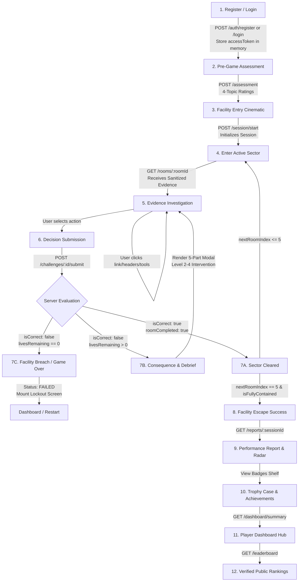

# FRONTEND-BACKEND INTEGRATION CONTRACT
## Digital Safety Escape Room

**Backend State**: **FROZEN** (Phases B0–B10 Complete, 19/19 Test Suites / 197 Tests Passing)  
**Contract Version**: 1.0.0 (Authoritative)  
**API Prefix**: `/api/v1`  
**Base URL**: `http://localhost:5000/api/v1` (Configured via `VITE_API_BASE_URL`)

---

## 1. Core Principles of Authority

The application enforces strict **Server Authority**. The frontend UI operates purely as an untrusted presentation layer:

1. **The backend authoritatively determines challenge correctness**: The frontend transmits the player's action selection (`actionId`, `containmentSequence`, `inspectedArtifacts`); the server validates it against hidden threat models and IoC definitions.
2. **The backend authoritatively determines score**: Scores mutate strictly via server-side scoring algorithms factoring base points, difficulty multiplier, speed bonus, hint penalties, and mistake deductions. The client cannot set or modify score.
3. **The backend authoritatively determines lives**: Lives are decremented on the database via atomic operations when unsafe actions occur. The client merely renders heart indicators based on server response values.
4. **The backend authoritatively determines progression**: A player cannot access Room $N$ without recorded server clearance of Rooms $1 \dots N-1$. Unsealed rooms return HTTP 403.
5. **The backend authoritatively determines completion**: The transition from `IN_PROGRESS` to `COMPLETED` occurs exclusively when Sector 05 (The Control Room) containment is cleared.
6. **The backend authoritatively awards achievements**: Badges are evaluated and persisted in MongoDB on the server upon session completion. The client cannot unlock badges.
7. **The backend authoritatively publishes leaderboard entries**: Only validated completed runs generate `LeaderboardEntry` records. The client cannot submit or forge leaderboard records.

---

## 2. Standard API Response Envelopes

All responses follow standardized JSON structures:

### Success Envelope
```json
{
  "success": true,
  "data": { ... }
}
```

### Error Envelope
```json
{
  "success": false,
  "error": {
    "code": "ERROR_CODE_STRING",
    "message": "Human-readable description of error.",
    "details": null
  }
}
```

### Rate Limiting Policy
* **Global API Limit**: 120 requests per minute per IP (`apiLimiter`).
* **Authentication Limit** (`/api/v1/auth/*`): 10 attempts per 15-minute window per IP (`authLimiter`).
* **Challenge Limit** (`/api/v1/challenges/*/submit`): 30 actions per minute per session (`challengeLimiter`).
* **Violation Response**: HTTP 429 Too Many Requests with error code `RATE_LIMIT_EXCEEDED`.

---

## 3. Endpoints Catalog & Contract Specifications

---

### Tier 1: Authentication & Player Identity

#### 1.1 `POST /api/v1/auth/register`
* **Description**: Create a new player account with bcrypt cost 12 hashed credentials.
* **Authentication**: None.
* **Request Body**:
  ```json
  {
    "username": "CadetAlpha",
    "email": "alpha@facility.mil",
    "password": "Password123!Secure"
  }
  ```
  * `username`: string, required, 3–30 chars, alphanumeric + `_` + `-`.
  * `email`: string, required, valid email format, trimmed, lowercase.
  * `password`: string, required, 8–100 chars.
* **Headers Received**:
  * `Set-Cookie`: `refreshToken=<jwt>; HttpOnly; Path=/; SameSite=Strict; [Secure in prod]`
* **Success Response (201 Created)**:
  ```json
  {
    "success": true,
    "data": {
      "user": {
        "_id": "66e01234567890abcdef1234",
        "username": "CadetAlpha",
        "email": "alpha@facility.mil",
        "role": "player",
        "createdAt": "2026-09-10T12:00:00.000Z",
        "updatedAt": "2026-09-10T12:00:00.000Z"
      },
      "accessToken": "eyJhbGciOiJIUzI1NiIs..."
    }
  }
  ```
* **Error Responses**:
  * `400 VALIDATION_ERROR`: Missing field, invalid email format, short password, or invalid username regex.
  * `409 DUPLICATE_EMAIL`: Email already registered.
  * `409 DUPLICATE_USERNAME`: Username already taken.

#### 1.2 `POST /api/v1/auth/login`
* **Description**: Authenticate credentials and receive short-lived access token and HttpOnly refresh cookie.
* **Authentication**: None. Rate limited (10 attempts / 15 min).
* **Request Body**:
  ```json
  {
    "email": "alpha@facility.mil",
    "password": "Password123!Secure"
  }
  ```
* **Success Response (200 OK)**:
  ```json
  {
    "success": true,
    "data": {
      "user": {
        "_id": "66e01234567890abcdef1234",
        "username": "CadetAlpha",
        "email": "alpha@facility.mil",
        "role": "player",
        "createdAt": "2026-09-10T12:00:00.000Z",
        "updatedAt": "2026-09-10T12:00:00.000Z"
      },
      "accessToken": "eyJhbGciOiJIUzI1NiIs..."
    }
  }
  ```
* **Error Responses**:
  * `400 VALIDATION_ERROR`: Missing email or password.
  * `401 INVALID_CREDENTIALS`: Email not found or password incorrect (timing attack mitigation applied).
  * `429 RATE_LIMIT_EXCEEDED`: Too many failed login attempts from client IP.

#### 1.3 `POST /api/v1/auth/refresh`
* **Description**: Issue a new 15-minute access token using the HttpOnly refresh cookie.
* **Authentication**: Valid `refreshToken` cookie.
* **Request Body**: None (`{}`).
* **Success Response (200 OK)**:
  ```json
  {
    "success": true,
    "data": {
      "accessToken": "eyJhbGciOiJIUzI1NiIs...",
      "user": {
        "id": "66e01234567890abcdef1234",
        "username": "CadetAlpha",
        "role": "player"
      }
    }
  }
  ```
* **Error Responses**:
  * `401 TOKEN_MISSING`: No refresh token cookie attached.
  * `401 TOKEN_INVALID`: Tampered signature or malformed token.
  * `401 TOKEN_EXPIRED`: 7-day refresh token expired; player must re-login.

#### 1.4 `POST /api/v1/auth/logout`
* **Description**: Clear the HttpOnly refresh cookie and terminate player session.
* **Authentication**: Bearer Token.
* **Request Body**: None (`{}`).
* **Success Response (200 OK)**:
  ```json
  {
    "success": true,
    "message": "Successfully logged out"
  }
  ```

#### 1.5 `GET /api/v1/auth/me`
* **Description**: Fetch the currently authenticated player profile.
* **Authentication**: Bearer Token (`Authorization: Bearer <accessToken>`).
* **Success Response (200 OK)**:
  ```json
  {
    "success": true,
    "data": {
      "user": {
        "_id": "66e01234567890abcdef1234",
        "username": "CadetAlpha",
        "email": "alpha@facility.mil",
        "role": "player",
        "createdAt": "2026-09-10T12:00:00.000Z",
        "updatedAt": "2026-09-10T12:00:00.000Z"
      }
    }
  }
  ```
* **Error Responses**:
  * `401 TOKEN_MISSING` / `TOKEN_INVALID` / `TOKEN_EXPIRED`.

---

### Tier 2: Knowledge Assessment & Baseline Profiling

#### 2.1 `POST /api/v1/assessment`
* **Description**: Submit or update pre-game 4-topic baseline confidence ratings.
* **Authentication**: Bearer Token.
* **Request Body**:
  ```json
  {
    "phishingConfidence": 4,
    "passwordConfidence": 3,
    "qrConfidence": 4,
    "socialConfidence": 2,
    "tutorialRequested": true
  }
  ```
  * `phishingConfidence`: integer 1–5, required.
  * `passwordConfidence`: integer 1–5, required.
  * `qrConfidence`: integer 1–5, required.
  * `socialConfidence`: integer 1–5, required.
  * `tutorialRequested`: boolean, optional (defaults to `false`).
* **Success Response (200 OK)**:
  ```json
  {
    "success": true,
    "data": {
      "assessment": {
        "_id": "66e0a987654321fedcba4321",
        "userId": "66e01234567890abcdef1234",
        "phishingConfidence": 4,
        "passwordConfidence": 3,
        "qrConfidence": 4,
        "socialConfidence": 2,
        "tutorialRequested": true,
        "completedAt": "2026-09-10T12:02:00.000Z",
        "createdAt": "2026-09-10T12:02:00.000Z",
        "updatedAt": "2026-09-10T12:02:00.000Z"
      }
    }
  }
  ```
* **Error Responses**:
  * `400 VALIDATION_ERROR`: Ratings out of 1–5 range, non-integer, or missing.
  * `401 TOKEN_MISSING` / `TOKEN_INVALID`.

#### 2.2 `GET /api/v1/assessment`
* **Description**: Retrieve the player's saved baseline confidence assessment.
* **Authentication**: Bearer Token.
* **Success Response (200 OK)**:
  ```json
  {
    "success": true,
    "data": {
      "assessment": {
        "_id": "66e0a987654321fedcba4321",
        "userId": "66e01234567890abcdef1234",
        "phishingConfidence": 4,
        "passwordConfidence": 3,
        "qrConfidence": 4,
        "socialConfidence": 2,
        "tutorialRequested": true,
        "completedAt": "2026-09-10T12:02:00.000Z"
      }
    }
  }
  ```
  *(If user has not yet taken the assessment, `assessment` is `null`).*

---

### Tier 3: Game Session Lifecycle

#### 3.1 `POST /api/v1/session/start`
* **Description**: Initialize a new escape room playthrough. If an `IN_PROGRESS` session already exists for this user, returns the existing active session to resume.
* **Authentication**: Bearer Token.
* **Request Body**: None (`{}`).
* **Success Response (201 Created or 200 OK)**:
  ```json
  {
    "success": true,
    "data": {
      "session": {
        "_id": "66e0beefcafe012345678901",
        "userId": "66e01234567890abcdef1234",
        "currentRoomIndex": 1,
        "currentChallengeIndex": 0,
        "livesRemaining": 3,
        "currentScore": 0,
        "hintsUsed": [],
        "status": "IN_PROGRESS",
        "startTime": "2026-09-10T12:05:00.000Z"
      }
    }
  }
  ```

#### 3.2 `GET /api/v1/session/active`
* **Description**: Fetch current in-progress session state.
* **Authentication**: Bearer Token.
* **Success Response (200 OK)**:
  ```json
  {
    "success": true,
    "data": {
      "session": {
        "_id": "66e0beefcafe012345678901",
        "userId": "66e01234567890abcdef1234",
        "currentRoomIndex": 2,
        "currentChallengeIndex": 0,
        "livesRemaining": 3,
        "currentScore": 1200,
        "hintsUsed": [],
        "status": "IN_PROGRESS",
        "startTime": "2026-09-10T12:05:00.000Z"
      }
    }
  }
  ```
  *(If no session is currently active, `session` is `null`).*

#### 3.3 `POST /api/v1/session/abandon`
* **Description**: Manually forfeit and lock the current in-progress session.
* **Authentication**: Bearer Token.
* **Request Body**: None (`{}`).
* **Success Response (200 OK)**:
  ```json
  {
    "success": true,
    "message": "Session abandoned",
    "data": {
      "session": {
        "_id": "66e0beefcafe012345678901",
        "status": "ABANDONED"
      }
    }
  }
  ```
* **Error Responses**:
  * `404 NO_ACTIVE_SESSION`: No active session exists to abandon.

---

### Tier 4: Room Investigation & Presentation

#### 4.1 `GET /api/v1/rooms/:roomId`
* **Description**: Retrieve sanitized evidence and active challenge presentation data for a room.
* **Authentication**: Bearer Token.
* **Route Params**:
  * `roomId`: string, required (`room-01-inbox` \| `room-02-vault` \| `room-03-scanner` \| `room-04-message` \| `room-05-control`).
* **Prerequisites**: Player must own an active `IN_PROGRESS` session, and the requested room's sector number must be $\le \text{session.currentRoomIndex}$.
* **Success Response (200 OK)**:
  ```json
  {
    "success": true,
    "data": {
      "roomId": "room-01-inbox",
      "sectorNumber": 1,
      "title": "The Inbox",
      "topic": "phishing",
      "narrative": "A critical terminal has been intercepted. Analyze incoming transmissions and neutralize phishing threats.",
      "totalChallengesInSector": 1,
      "currentChallengeIndex": 0,
      "challenge": {
        "challengeId": "ch-phish-01",
        "topic": "phishing",
        "difficulty": "beginner",
        "prompt": "Inspect the newly arrived IT security advisory before choosing how to respond.",
        "evidence": {
          "type": "email",
          "sender": "IT Support Center <support@micr0soft-update.com>",
          "replyTo": "inbox-collector@shadow-c2.net",
          "subject": "URGENT: Required Credential Resynchronization",
          "receivedTime": "2026-09-10T11:45:00Z",
          "body": "Security breach detected. Click the emergency link below to verify your facility workstation immediately.",
          "linkTarget": "http://185.220.101.4/login.php",
          "linkDisplayText": "https://security.microsoft.com/sync-session",
          "headers": {
            "spf": "FAIL",
            "dkim": "NONE",
            "dmarc": "FAIL"
          }
        },
        "availableActions": [
          { "actionId": "ACTION_QUARANTINE", "label": "Quarantine & Report Phishing", "variant": "primary" },
          { "actionId": "ACTION_CLICK_LINK", "label": "Click Link to Sync Session", "variant": "danger" },
          { "actionId": "ACTION_IGNORE", "label": "Ignore Transmission", "variant": "ghost" }
        ],
        "hasHints": true
      },
      "session": {
        "sessionId": "66e0beefcafe012345678901",
        "livesRemaining": 3,
        "currentScore": 0,
        "currentRoomIndex": 1
      }
    }
  }
  ```
* **Error Responses**:
  * `400 VALIDATION_ERROR`: Missing or malformed `roomId`.
  * `403 NO_ACTIVE_SESSION`: Player has not started a session.
  * `403 PREREQUISITES_INCOMPLETE`: Sector is locked; player has not yet cleared prerequisite sectors.
  * `404 ROOM_NOT_FOUND`: Sector identifier does not match facility manifest.
* **Fields Frontend May Display**: `title`, `narrative`, `prompt`, `evidence` (subject, body, headers, links), `availableActions` (buttons), `hasHints`.
* **Fields NEVER Transmitted**: `correctActionId`, `hiddenIoCs`, hidden explanation, solution keys.

---

### Tier 5: Tactical Decisions, Validation & Hints

#### 5.1 `POST /api/v1/challenges/:id/submit`
* **Description**: Submit tactical decision for server-side evaluation.
* **Authentication**: Bearer Token. Rate limited (30 actions/min).
* **Route Params**:
  * `id`: string, required (e.g. `ch-phish-01`).
* **Request Body**:
  ```json
  {
    "sessionId": "66e0beefcafe012345678901",
    "actionId": "ACTION_QUARANTINE",
    "containmentSequence": ["ACTION_SEVER_DC_C2", "ACTION_LOCK_VAULT_CREDS", "ACTION_ISOLATE_HELPDESK_PRETEXT", "ACTION_PURGE_KIOSK_QR"],
    "inspectedArtifacts": ["typosquatted_domain", "mismatched_href_text", "spf_fail"],
    "timeElapsedSeconds": 14
  }
  ```
  * `sessionId`: 24-character hex ObjectId, required.
  * `actionId`: string, required.
  * `containmentSequence`: array of strings, optional (required for Room 05 multi-threat triage).
  * `inspectedArtifacts`: array of strings, optional (IoC inspection bonus tracking).
  * `timeElapsedSeconds`: number $\ge 0$, optional (defaults to 15).

##### Outcome A: Correct Decision (Progression)
```json
{
  "success": true,
  "data": {
    "isCorrect": true,
    "consequence": "Phishing attack successfully neutralized! Malicious communication quarantined.",
    "scoreDelta": 1240,
    "currentScore": 1240,
    "livesRemaining": 3,
    "roomCompleted": true,
    "nextRoomIndex": 2,
    "escapeCompleted": false,
    "gameStatus": "IN_PROGRESS",
    "investigationBonusAwarded": true
  }
}
```

##### Outcome B: Correct Final Decision (Room 05 Escape Complete)
```json
{
  "success": true,
  "data": {
    "isCorrect": true,
    "consequence": "Multi-threat containment complete! Facility secure.",
    "scoreDelta": 3120,
    "currentScore": 9420,
    "livesRemaining": 3,
    "roomCompleted": true,
    "nextRoomIndex": 5,
    "isFullyContained": true,
    "escapeCompleted": true,
    "gameStatus": "COMPLETED",
    "completionTime": "2026-09-10T12:15:00.000Z",
    "isLeaderboardEligible": true,
    "badgesEarned": ["CYBER_GUARDIAN", "ZERO_MISTAKE_ESCAPE", "MULTI_THREAT_MASTER"],
    "containedThreats": ["dc_c2", "vault_creds", "helpdesk_pretext", "kiosk_qr"]
  }
}
```

##### Outcome C: Incorrect Decision (Life Deducted & Adaptive Debrief)
```json
{
  "success": true,
  "data": {
    "isCorrect": false,
    "consequence": "Malicious payload executed! Clicking the unverified link exposed workstation credentials.",
    "scoreDelta": 0,
    "currentScore": 1240,
    "livesRemaining": 2,
    "gameOver": false,
    "gameStatus": "IN_PROGRESS",
    "learningIntervention": {
      "level": 2,
      "type": "CONTEXTUAL_EXPLANATION",
      "topic": "phishing",
      "explanation": {
        "whatHappened": "The incoming transmission used an unauthorized lookalike domain to harvest credentials.",
        "evidence": "Sender domain was 'micr0soft-update.com' with a numeral 0, and SPF authentication failed.",
        "whyDangerous": "Clicking the link routes to an attacker-controlled credential harvesting terminal.",
        "correctAction": "Quarantine the communication and file an immediate SOC incident report.",
        "securityTip": "Always inspect the actual domain URL after the @ sign rather than trusting the display name."
      }
    }
  }
}
```

##### Outcome D: Zero Lives (Facility Breach / Game Over)
```json
{
  "success": true,
  "data": {
    "isCorrect": false,
    "consequence": "Lockdown breached! Facility permanently compromised.",
    "livesRemaining": 0,
    "gameOver": true,
    "reason": "LOCKDOWN_BREACH",
    "gameStatus": "FAILED",
    "learningIntervention": { ... }
  }
}
```

* **Error Responses**:
  * `400 VALIDATION_ERROR`: Malformed `sessionId` or missing `actionId`.
  * `403 FORBIDDEN_SESSION_ACCESS`: IDOR guard triggered (session belongs to another user).
  * `403 PREREQUISITES_INCOMPLETE`: Sector is locked; player cannot submit to future rooms.
  * `404 SESSION_NOT_FOUND` / `CHALLENGE_NOT_FOUND`.
  * `409 CHALLENGE_ALREADY_COMPLETED`: Challenge already solved in this session (anti-replay).
  * `409 SESSION_LOCKED`: Session is `FAILED` or `COMPLETED`.
  * `429 RATE_LIMIT_EXCEEDED`: Submissions exceeding 30 req/min.

#### 5.2 `POST /api/v1/challenges/:id/hint`
* **Description**: Request tactical intelligence hint. Incurs a server-side 75-point score deduction.
* **Authentication**: Bearer Token.
* **Route Params**: `id` (challenge ID).
* **Request Body**: `{ "sessionId": "66e0beefcafe012345678901" }`.
* **Success Response (200 OK)**:
  ```json
  {
    "success": true,
    "data": {
      "hint": "Examine the sender root domain carefully—notice the number instead of a letter.",
      "hintsUsedCount": 1,
      "penaltyApplied": 75,
      "remainingHintsAvailable": 0
    }
  }
  ```
* **Error Responses**:
  * `400 NO_HINTS_AVAILABLE`: All hints exhausted for this challenge.
  * `403 FORBIDDEN_SESSION_ACCESS`: IDOR guard.
  * `409 SESSION_LOCKED`: Session is closed.

---

### Tier 6: Results, Performance Analysis & Achievements

#### 6.1 `GET /api/v1/reports/:sessionId`
* **Description**: Generate detailed Cybersecurity Performance Report for a completed escape run.
* **Authentication**: Bearer Token.
* **Route Params**: `sessionId` (24-hex ObjectId).
* **Prerequisites**: Session status must be `COMPLETED` and owned by authenticated user.
* **Success Response (200 OK)**:
  ```json
  {
    "success": true,
    "data": {
      "sessionId": "66e0beefcafe012345678901",
      "userId": "66e01234567890abcdef1234",
      "status": "COMPLETED",
      "overallScore": 9240,
      "finalScore": 9240,
      "accuracy": 89,
      "accuracyPercentage": 89,
      "livesRemaining": 2,
      "completionTime": "2026-09-10T12:15:00.000Z",
      "totalDurationSeconds": 600,
      "challengesCompleted": 8,
      "hintsUsed": 1,
      "hintsUsedCount": 1,
      "mistakes": 1,
      "totalMistakes": 1,
      "topicMastery": {
        "phishing": 100,
        "password_security": 50,
        "qr_security": 100,
        "social_engineering": 100,
        "multi_threat": 100,
        "passwordSecurity": 50,
        "qrSecurity": 100,
        "socialEngineering": 100,
        "multiThreat": 100
      },
      "topicScores": {
        "phishing": 100,
        "passwordSecurity": 50,
        "qrSecurity": 100,
        "socialEngineering": 100,
        "multiThreat": 100
      },
      "strongestSkill": "qr_security",
      "weakestSkill": "password_security",
      "primaryVulnerability": "password_security",
      "personalizedRecommendation": "Mandate unique, random 16+ character passphrases stored in a password manager and upgrade from SMS to FIDO2 hardware tokens.",
      "personalizedActionableRecommendation": "Mandate unique, random 16+ character passphrases stored in a password manager and upgrade from SMS to FIDO2 hardware tokens.",
      "badgesEarned": ["CYBER_GUARDIAN", "PHISHING_EXPERT", "QR_DETECTIVE", "SOCIAL_SHIELD", "MULTI_THREAT_MASTER"]
    }
  }
  ```
* **Error Responses**:
  * `400 VALIDATION_ERROR`: Malformed `sessionId`.
  * `400 REPORT_NOT_AVAILABLE`: Session is `IN_PROGRESS`, `FAILED`, or `ABANDONED`.
  * `403 FORBIDDEN_REPORT_ACCESS`: Session belongs to another player.
  * `404 SESSION_NOT_FOUND`.

---

### Tier 7: Player Career Dashboard

#### 7.1 `GET /api/v1/dashboard/summary`
* **Description**: Fetch player career statistics, active session resume state, recent playthroughs, and unlocked achievement trophies.
* **Authentication**: Bearer Token.
* **Success Response (200 OK)**:
  ```json
  {
    "success": true,
    "data": {
      "userId": "66e01234567890abcdef1234",
      "username": "CadetAlpha",
      "email": "alpha@facility.mil",
      "activeSession": {
        "sessionId": "66e0beefcafe012345678901",
        "currentRoomIndex": 3,
        "currentRoomId": "room-03-scanner",
        "currentScore": 2800,
        "livesRemaining": 2,
        "startTime": "2026-09-10T12:05:00.000Z",
        "hintsUsedCount": 1
      },
      "currentRoom": "room-03-scanner",
      "overallProgress": 40,
      "currentScore": 2800,
      "currentLives": 2,
      "bestScore": 9500,
      "totalEscapes": 1,
      "totalSessions": 3,
      "gameHistory": [
        {
          "sessionId": "66e0pastsession0000000001",
          "status": "COMPLETED",
          "finalScore": 9500,
          "currentScore": 9500,
          "livesRemaining": 2,
          "currentRoomIndex": 5,
          "startTime": "2026-09-09T14:00:00.000Z",
          "completionTime": "2026-09-09T14:12:00.000Z",
          "durationSeconds": 720,
          "date": "2026-09-09T14:12:00.000Z"
        }
      ],
      "achievements": [
        {
          "badgeCode": "CYBER_GUARDIAN",
          "title": "Cyber Guardian",
          "description": "Successfully completed the facility escape and neutralized all cyber threats.",
          "earnedAt": "2026-09-09T14:12:00.000Z"
        }
      ],
      "topicPerformance": {
        "phishing": 100,
        "password_security": 75,
        "qr_security": 100,
        "social_engineering": 80,
        "multi_threat": 100,
        "passwordSecurity": 75,
        "qrSecurity": 100,
        "socialEngineering": 80,
        "multiThreat": 100
      }
    }
  }
  ```
  *(If no session is currently in progress, `activeSession` and `currentRoom` are `null`, and `overallProgress` is `100` if escapes $>0$, else `0`).*

---

### Tier 8: Verified Escape Leaderboard

#### 8.1 `GET /api/v1/leaderboard`
* **Description**: Retrieve verified public facility escape rankings.
* **Authentication**: None (Public).
* **Query Parameters**:
  * `page`: integer, optional (defaults to 1).
  * `limit`: integer, optional (defaults to 50, max 100).
* **Sorting**: Ordered strictly by `finalScore` descending, tie-broken by `totalDurationSeconds` ascending (faster completion wins).
* **Success Response (200 OK)**:
  ```json
  {
    "success": true,
    "data": {
      "totalEntries": 142,
      "page": 1,
      "limit": 50,
      "totalPages": 3,
      "leaderboard": [
        {
          "rank": 1,
          "id": "66e0leadentry00000000001",
          "sessionId": "66e0beefcafe012345678901",
          "userId": "66e01234567890abcdef1234",
          "username": "OperatorZero",
          "finalScore": 9850,
          "totalDurationSeconds": 480,
          "accuracyPercentage": 100,
          "livesRemaining": 3,
          "badgesEarned": ["CYBER_GUARDIAN", "ZERO_MISTAKE_ESCAPE", "MULTI_THREAT_MASTER"],
          "recordedAt": "2026-09-10T12:15:00.000Z",
          "isVerified": true
        },
        {
          "rank": 2,
          "id": "66e0leadentry00000000002",
          "sessionId": "66e0beefcafe012345678902",
          "userId": "66e09876543210fedcba4321",
          "username": "CadetAlpha",
          "finalScore": 9240,
          "totalDurationSeconds": 600,
          "accuracyPercentage": 89,
          "livesRemaining": 2,
          "badgesEarned": ["CYBER_GUARDIAN"],
          "recordedAt": "2026-09-10T12:20:00.000Z",
          "isVerified": true
        }
      ]
    }
  }
  ```
* **Anti-Manipulation Guarantee**: Incomplete, failed, and abandoned sessions never appear. Direct `POST /api/v1/leaderboard` returns HTTP 404.

---

## 4. End-to-End Gameplay Flow Architecture

The frontend follows this strict state transition graph:



---

## 5. Frontend Error Handling Strategy

| HTTP Status | Error Code | Root Cause | Expected Frontend Handling |
| :--- | :--- | :--- | :--- |
| **401 Unauthorized** | `TOKEN_MISSING`<br>`TOKEN_INVALID`<br>`TOKEN_EXPIRED` | Access token missing, tampered, or expired ($>15\text{m}$) | Axios response interceptor calls `POST /api/v1/auth/refresh`. If refresh succeeds, retries original request with new token. If refresh fails, clears in-memory token and redirects to `/auth` with `returnUrl` state. |
| **401 Unauthorized** | `INVALID_CREDENTIALS` | Incorrect login email or password | Render red terminal warning: *"Invalid email or password credentials"* on the login card. |
| **403 Forbidden** | `FORBIDDEN_SESSION_ACCESS`<br>`FORBIDDEN_REPORT_ACCESS` | IDOR violation (accessing another user's session or report) | Display security alert: *"Access Denied: Clearance credentials do not match sector authorization"*. Redirect to `/dashboard`. |
| **403 Forbidden** | `PREREQUISITES_INCOMPLETE` | Attempting to navigate ahead to a sealed sector | Display sealed bulkhead animation with warning toast: *"Clearance denied: Previous sector remains compromised"*. Keep player in their active sector. |
| **403 Forbidden** | `NO_ACTIVE_SESSION` | Accessing `/rooms/*` without an active game | Redirect player to `/assessment` (if new) or trigger `POST /session/start`. |
| **404 Not Found** | `ROOM_NOT_FOUND`<br>`SESSION_NOT_FOUND` | Non-existent sector or deleted session ID | Display terminal 404 alert: *"Requested sector coordinates not found on facility grid"*. Redirect to `/dashboard`. |
| **409 Conflict** | `CHALLENGE_ALREADY_COMPLETED` | Duplicate submission on already cleared challenge | Disable the submission button, notify player: *"Challenge already solved"*, and transition to next challenge/room. |
| **409 Conflict** | `SESSION_LOCKED` | Action submitted to `COMPLETED` or `FAILED` session | Lock all terminal inputs. If `FAILED`, mount Game Over modal. If `COMPLETED`, mount Escape Result screen. |
| **429 Too Many Requests** | `RATE_LIMIT_EXCEEDED` | Spammed challenge actions ($>30/\text{min}$) or logins ($>10/15\text{min}$) | Temporarily disable action buttons for 15 seconds; display amber countdown toast: *"Terminal telemetry throttled: Please pause investigation before retrying"*. |
| **500 Internal Error** | `INTERNAL_SERVER_ERROR` | Unhandled backend exception | Display non-intrusive terminal failure banner: *"Terminal connection anomaly: Security kernel rebooting"*. Offer `"Retry Action"` button without discarding user's entered state. |
| **503 Unavailable** | `SERVICE_UNAVAILABLE` | Database temporarily reconnecting | Axios interceptor performs exponential backoff retry (up to 3 attempts, 1s, 2s, 4s) before presenting offline banner. |

---

## 6. Prohibited Frontend Practices

1. **NO Local Score Calculation**: Never compute points on the frontend. Only display `data.currentScore` or `data.scoreDelta` returned from the server.
2. **NO Local Life Decrementing**: Never decrement lives on client click. Only update lives when the server responds with `data.livesRemaining`.
3. **NO Client-Side Progression Jumps**: Never update current room index purely in client state. Only navigate when `data.nextRoomIndex` advances.
4. **NO Hardcoded Answer Keys**: Do not store correct action IDs in frontend components or constants. The backend validates actions against secret server memory.
5. **NO External State Architectures**: Do not introduce Redux, Zustand, or GraphQL. The frontend architecture strictly uses React Context (`AuthContext`, `GameSessionContext`, `AudioContext`) with Axios interceptors.
6. **NO Websocket Infrastructure**: All gameplay is authoritative REST HTTP.
