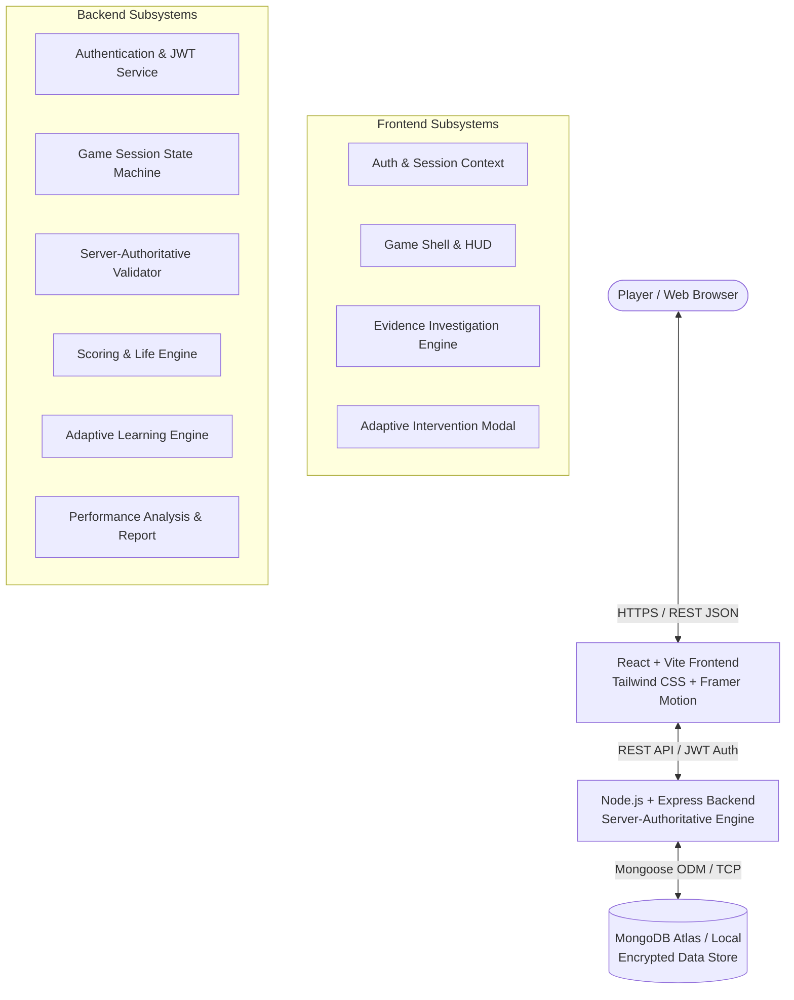
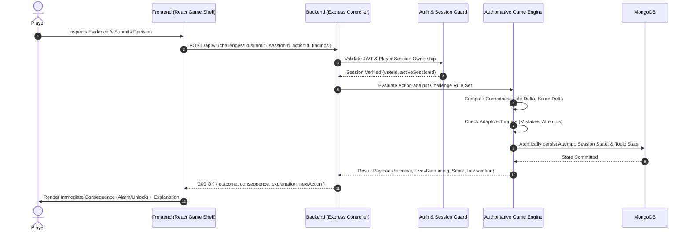
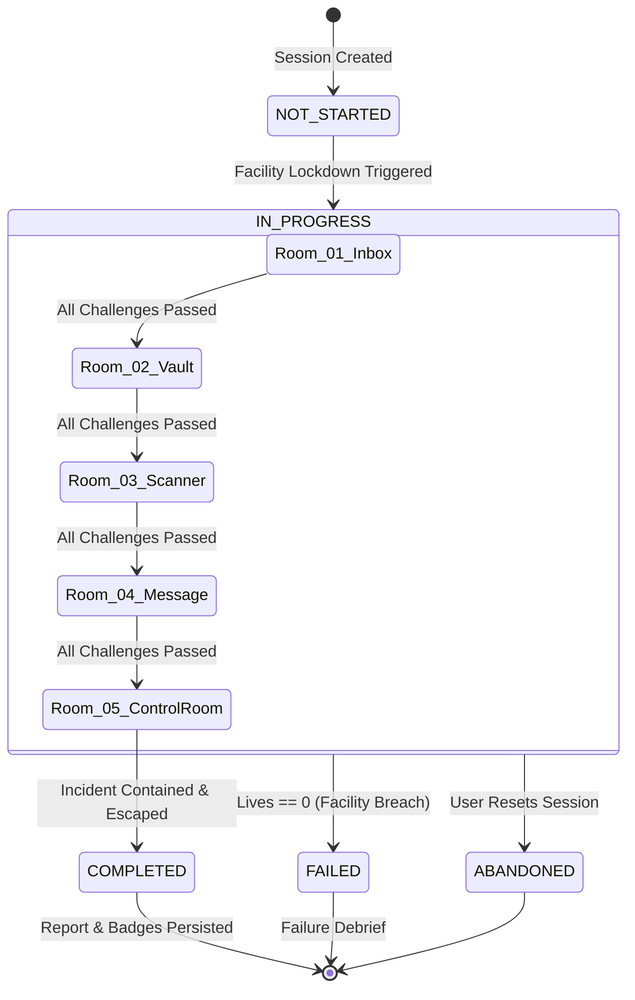
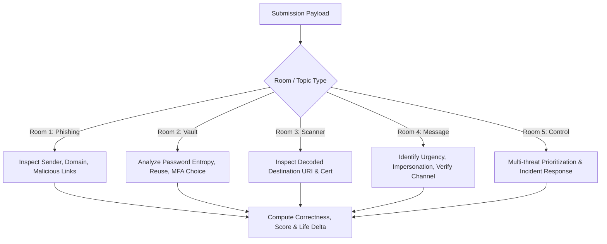
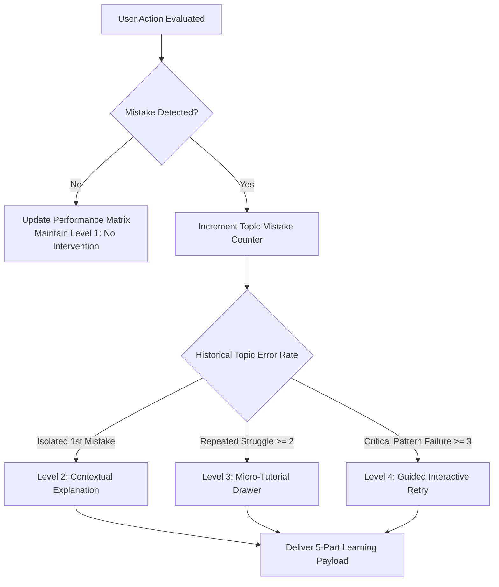
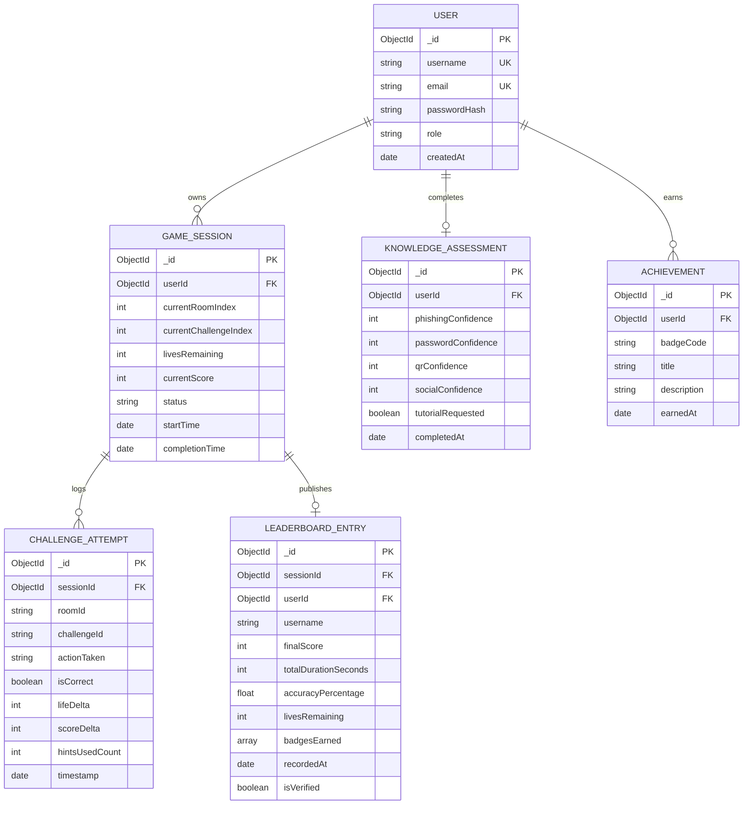
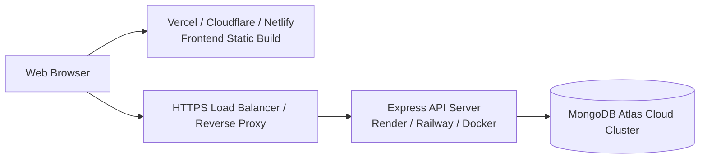

# TECHNICAL ARCHITECTURE
## Digital Safety Escape Room

---

### 1. System Overview

Digital Safety Escape Room is a story-driven, gamified cybersecurity educational web application built on the **MERN** stack (MongoDB, Express.js, React, Node.js). The application immerses players inside a compromised digital security facility under lockdown. To escape, players investigate authentic security artifacts, uncover indicators of compromise (IoCs), make critical defense decisions, face immediate consequences, and acquire contextual cybersecurity knowledge.



The system is strictly divided into an untrusted client presentation layer and a trusted server-authoritative game engine. The client presents dynamic interactive terminal rooms and collects user actions. The server validates challenge actions against hidden threat models, calculates score mutations and life deductions, drives progression state, and evaluates adaptive learning triggers.

---

### 2. Frontend / Backend Separation

The repository is divided into two decoupled workspaces with distinct execution contexts:

```
/c/game
├── backend/                # Node.js + Express REST API Server
├── frontend/               # React + Vite Single Page Application (SPA)
├── docs/                   # Architecture, UX, and Phase Documentation
└── master_implementationplan.md # Master Source of Truth
```

#### Communication Boundary
* **Protocol**: RESTful HTTP/1.1 over TLS (HTTPS).
* **Data Format**: `application/json` for all request bodies and responses.
* **Stateless Transport**: Every request is authenticated via bearer tokens or secure HTTP-only session cookies.
* **Separation of Concerns**:
  * The frontend contains **zero** challenge answer keys, scoring tables, or life deduction algorithms.
  * The backend contains **zero** JSX/UI rendering logic, acting purely as an API and validation daemon.

---

### 3. Request / Response Flow

All game actions follow a strict transactional cycle ensuring synchronization between the player's view and backend authoritative state:



---

### 4. REST API Architecture

The backend exposes a versioned API root at `/api/v1`. Endpoints are grouped logically by domain:

| Endpoint Domain | Base URI | Responsibility |
| :--- | :--- | :--- |
| **Authentication** | `/api/v1/auth` | User registration, login, token refresh, profile |
| **Knowledge Assessment**| `/api/v1/assessment` | Baseline security survey submission and retrieval |
| **Game Session** | `/api/v1/session` | Create, fetch active, abandon, or finalize escape sessions |
| **Rooms & Challenges** | `/api/v1/rooms` | Fetch sanitized room metadata and active challenge data |
| **Challenge Engine** | `/api/v1/challenges`| Submit evidence actions, request hints, advance rooms |
| **Player Dashboard** | `/api/v1/dashboard` | Historical playthroughs, statistics, continue pointer |
| **Leaderboard** | `/api/v1/leaderboard`| Public verified leaderboard rankings and statistics |
| **Achievements** | `/api/v1/achievements`| User badges, criteria verification, showcase |

---

### 5. Authentication Architecture

Authentication uses industry-standard JSON Web Tokens (JWT) combined with `bcrypt` password hashing.

```mermaid
graph LR
    Client[React Client] -->|1. Credentials POST| AuthEndpoint[/api/v1/auth/login]
    AuthEndpoint -->|2. Verify Hash| DB[(User Collection)]
    AuthEndpoint -->|3. Issue Tokens| Client
    subgraph Token Strategy
        AT[Short-lived Access Token\nExpires in 15 mins\nIn-Memory React State]
        RT[Long-lived Refresh Token\nExpires in 7 days\nHttpOnly, Secure, SameSite Cookie]
    end
```

#### Authentication Rules
1. **Password Security**: Passwords hashed using `bcryptjs` with a minimum cost factor of 12.
2. **Access Token**: Contains `{ userId, username, role }`. Signed using `JWT_SECRET` (HMAC-SHA256). Short lifetime (15 minutes). Stored exclusively in application memory (never in `localStorage` to eliminate XSS token theft).
3. **Refresh Token**: Signed using `JWT_REFRESH_SECRET`. Stored in an `HttpOnly`, `Secure` (in production), `SameSite=Strict` cookie.
4. **Silent Refresh**: The frontend Axios client catches `401 Unauthorized` responses and triggers `/api/v1/auth/refresh` transparently before re-issuing the failed request.

---

### 6. Authorization Model & IDOR Prevention

All game-modifying endpoints enforce strict ownership checks:
* **Session Ownership**: A player can only inspect, interact with, or submit actions for a `GameSession` where `session.userId === req.user.id`.
* **Insecure Direct Object Reference (IDOR) Mitigation**:
  ```javascript
  // Example Authorization Middleware Check
  const session = await GameSession.findById(req.body.sessionId);
  if (!session || session.userId.toString() !== req.user.id) {
    return res.status(403).json({ success: false, error: "Access denied to requested game session." });
  }
  ```
* **State Tampering Blockers**: Completed or abandoned sessions are locked. Any submission to a session where `status !== 'IN_PROGRESS'` is rejected immediately with HTTP 409 Conflict.

---

### 7. Game Session Architecture

A game session manages a player's playthrough from lockdown to escape or failure.



#### Session State Attributes
* `sessionId`: Unique UUID / Mongo ObjectId.
* `userId`: Reference to User.
* `currentRoomIndex`: Pointer from 1 to 5.
* `currentChallengeIndex`: Current challenge within the active room.
* `livesRemaining`: Integer (initialized to 3, range 0–3).
* `currentScore`: Authoritative accumulated integer score.
* `hintsUsed`: Tracked count and identifiers of revealed hints.
* `attempts`: Historical log of all decisions.
* `status`: Enum (`NOT_STARTED`, `IN_PROGRESS`, `COMPLETED`, `FAILED`, `ABANDONED`).
* `startTime` / `completionTime`: Timestamps for duration tracking.

---

### 8. Server-Authoritative Game State

The frontend is treated as an untrusted presentation layer. The following matrix illustrates the authority boundary:

| Game Attribute | Client Role | Server Role (Authoritative) |
| :--- | :--- | :--- |
| **Score** | Displays received score with animations | Computes all bonuses/penalties; stores true value |
| **Lives Remaining** | Renders heart icons (♥♥♥) | Decrements on error; triggers Game Over when 0 |
| **Room Progression** | Triggers transition animation on 200 OK | Validates room prerequisites; unlocks next room ID |
| **Challenge Correctness**| Sends user action payload `{ actionId }` | Evaluates against private answer key in memory/DB |
| **Evidence Inspection** | Records UI click events (inspect link, etc.) | Verifies if required IoC inspections occurred |
| **Leaderboard Rank** | Reads sorted public list | Generates rankings strictly from COMPLETED sessions |

---

### 9. Challenge Validation Engine

The server validates challenges dynamically based on room type:



#### Room Validation Logic
1. **Room 01 (The Inbox - Phishing)**: Checks if user accurately identified spoofed headers, typosquatted domains (e.g., `micros0ft.com`), or malicious attachment payloads versus legitimate communications.
2. **Room 02 (The Vault - Password & MFA)**: Assesses password hygiene (length, entropy, credential stuffing exposure) and mandates selecting hardware/app-based MFA over vulnerable SMS fallbacks.
3. **Room 03 (The Scanner - QR / Quishing)**: Validates destination inspection before interaction, recognizing deceptive URL shorteners and unauthorized credential harvesters.
4. **Room 04 (The Message - Social Engineering)**: Evaluates response to authority pressure, false urgency, and OTP leakage attempts. Rewards out-of-band verification.
5. **Room 05 (The Control Room - Multi-Threat)**: Requires threat triage, incident containment prioritization, and coordinated remediation across email, authentication, QR, and social vectors.

---

### 10. Score Calculation Architecture

Score calculation is deterministic, transparent, and strictly executed on the server.

$$\text{Final Challenge Score} = \max\Big(0, \big(\text{BasePoints} \times \text{DifficultyMultiplier}\big) + \text{TimeBonus} - \text{HintPenalty} - \text{MistakePenalty}\Big)$$

#### Component Breakdown
* **Base Points**: 500 points per standard challenge; 1,500 points for Control Room multi-threat challenges.
* **Difficulty Multiplier**:
  * Beginner: $1.0\times$
  * Intermediate: $1.25\times$
  * Advanced: $1.5\times$
  * Expert: $2.0\times$
* **Time Bonus**: $\max\big(0, (T_{\text{target}} - T_{\text{elapsed}}) \times 2\big)$ points. Capped at 200 points.
* **Hint Penalty**: 75 points deducted per hint revealed.
* **Mistake Penalty**: 150 points deducted per incorrect attempt on that challenge.
* **Integrity Guard**: A challenge score cannot drop below 50 points upon successful completion, rewarding eventual mastery.

---

### 11. Lives Handling & Game Over Rules

* **Initial Life Pool**: Every player begins a session with **3 Lives** ($\heartsuit\heartsuit\heartsuit$).
* **Life Deduction**:
  * Any critical security failure (e.g., clicking a confirmed credential harvesting link, disabling MFA on admin account, divulging OTP to an attacker) deducts **1 Life**.
  * Minor investigation missteps (e.g., inspecting an irrelevant header) do not deduct lives but may incur slight score deductions.
* **Zero Life Condition (Facility Breach)**:
  * When lives reach $0$, the session status transitions immediately to `FAILED`.
  * The server marks the session closed and returns a `lockdown_breached` status.
  * The player is provided with a security failure debrief and an option to restart the room or session.

---

### 12. Progression Validation

Room progression is strictly enforced sequentially:

$$\text{Room 01} \longrightarrow \text{Room 02} \longrightarrow \text{Room 03} \longrightarrow \text{Room 04} \longrightarrow \text{Room 05} \longrightarrow \text{Escape}$$

* **Prerequisite Enforcement**: When a client requests challenge details or submits actions for Room $N$, the backend verifies that all challenges for Rooms $1 \dots N-1$ have recorded `SUCCESS` attempts in that active session.
* **Direct Jumping Prevention**: Direct API requests to `/api/v1/rooms/05` by a player currently on Room 02 return HTTP 403 Forbidden with `{ error: "Prerequisite rooms incomplete" }`.

---

### 13. Adaptive Learning Architecture

The adaptive learning engine dynamically adjusts instructional scaffolding without altering the underlying escape room difficulty.



#### 5-Part Educational Framework
Every learning payload returned by the server adheres strictly to this structure:
1. **WHAT HAPPENED**: Clear, factual statement of the action taken.
2. **EVIDENCE**: Specific indicators that exposed the threat (e.g., typosquatted domain, misleading display name, mismatched QR payload).
3. **WHY IT WAS DANGEROUS**: The real-world consequence (e.g., session hijacking, malware execution, network pivoting).
4. **CORRECT ACTION**: The exact protocol the security professional should follow.
5. **PRACTICAL SECURITY TIP**: An actionable, memorable heuristic for daily digital hygiene.

---

### 14. Knowledge Assessment Architecture

Prior to facility entry, the player completes a 4-topic baseline confidence assessment covering:
1. **Phishing** (sender verification, domain analysis, link inspection)
2. **Password Security** (entropy, credential reuse, MFA modalities)
3. **QR Security / Quishing** (URL redirection, physical tampering, malicious intents)
4. **Social Engineering** (pretexting, authority manipulation, urgency detection)

* **Baseline Storage**: Stored in MongoDB under `KnowledgeAssessment`.
* **Adaptive Weighting**: Self-reported low confidence combined with early game mistakes accelerates Level 3 micro-tutorials. High confidence with repeated mistakes flags an overconfidence metric in the final report.

---

### 15. Database Architecture

The persistence layer uses MongoDB with Mongoose schemas:



---

### 16. Data Relationships & Schema Specifications

#### User Schema (`users`)
* `_id`: ObjectId
* `username`: String (Unique, Indexed, 3-30 chars)
* `email`: String (Unique, Indexed, Lowercase, Validated)
* `passwordHash`: String (bcrypt, min 60 chars)
* `createdAt`: Date, default `Date.now`

#### GameSession Schema (`game_sessions`)
* `_id`: ObjectId
* `userId`: ObjectId (Ref `User`, Indexed)
* `currentRoomIndex`: Number (1 to 5, default 1)
* `currentChallengeIndex`: Number (default 0)
* `livesRemaining`: Number (0 to 3, default 3)
* `currentScore`: Number (default 0)
* `hintsUsed`: Array of Strings
* `status`: String (`NOT_STARTED`, `IN_PROGRESS`, `COMPLETED`, `FAILED`, `ABANDONED`)
* `startTime`: Date
* `completionTime`: Date

#### ChallengeAttempt Schema (`challenge_attempts`)
* `_id`: ObjectId
* `sessionId`: ObjectId (Ref `GameSession`, Indexed)
* `roomId`: String (e.g., `room-01-inbox`)
* `challengeId`: String (e.g., `ch-phish-01`)
* `actionTaken`: String
* `isCorrect`: Boolean
* `scoreDelta`: Number
* `lifeDelta`: Number
* `hintsUsed`: Number
* `timestamp`: Date

---

### 17. API Boundaries & Endpoints Catalog

```
POST   /api/v1/auth/register               -> Register new account
POST   /api/v1/auth/login                  -> Authenticate and obtain tokens
POST   /api/v1/auth/refresh                -> Refresh access token via HttpOnly cookie
POST   /api/v1/auth/logout                 -> Invalidate refresh token cookie
GET    /api/v1/auth/me                     -> Retrieve authenticated user profile

POST   /api/v1/assessment                  -> Submit baseline confidence assessment
GET    /api/v1/assessment                  -> Retrieve baseline profile

POST   /api/v1/session/start               -> Initialize new game session
GET    /api/v1/session/active              -> Retrieve current in-progress session
POST   /api/v1/session/abandon             -> Terminate active session

GET    /api/v1/rooms/:roomId               -> Get room metadata & active challenge payload (sanitized)
POST   /api/v1/challenges/:id/submit       -> Submit evidence decision for validation
POST   /api/v1/challenges/:id/hint         -> Request hint for active challenge (incurs penalty)

GET    /api/v1/dashboard/summary           -> Get player statistics, active runs, and badges
GET    /api/v1/reports                     -> Root stub returning HTTP 501 (preserves phase expectations)
GET    /api/v1/reports/:sessionId          -> Get final Cybersecurity Performance Report
GET    /api/v1/leaderboard                 -> Get top verified escape records
```

---

### 18. Error Handling Strategy

Errors are intercepted globally and returned in a unified JSON envelope:

```json
{
  "success": false,
  "error": {
    "code": "SESSION_LOCKED",
    "message": "Game session has failed due to facility breach. No further submissions permitted.",
    "details": null
  }
}
```

#### HTTP Status Code Convention
* `200 OK`: Request succeeded.
* `201 Created`: Resource successfully created.
* `400 Bad Request`: Input validation failed (Zod/Joi error breakdown in `details`).
* `401 Unauthorized`: Token missing, invalid, or expired.
* `403 Forbidden`: Authenticated user does not own resource or prerequisite rooms incomplete.
* `404 Not Found`: Room, challenge, or session ID does not exist.
* `409 Conflict`: Invalid state transition (e.g., submitting to a closed session).
* `429 Too Many Requests`: Rate limit exceeded.
* `500 Internal Server Error`: Unhandled server exception (sanitized in production).

---

### 19. Security Architecture & Threat Model

| Threat Vector | Potential Impact | Countermeasure / Architectural Defense |
| :--- | :--- | :--- |
| **Score / Life Tampering** | Falsified leaderboard | Server-authoritative state. All calculations done in backend. Client never transmits score or life count. |
| **Answer Scraping** | Players inspect network packets | Sanitized challenge payloads. Answers and IoC keys are stored exclusively in backend memory and never sent to client. |
| **Credential Stuffing** | Account compromise | `bcrypt` (cost 12), strict rate limiting on `/api/v1/auth/login`. |
| **XSS (Cross-Site Scripting)**| Session hijacking | Tokens in memory/HttpOnly cookies. Frontend uses DOMPurify when rendering simulated email/terminal evidence. |
| **NoSQL Injection** | Unauthorized data access | Mongoose strict typing, `express-mongo-sanitize` middleware stripping `$` and `.` operators. |
| **IDOR** | View/alter other players' games | Explicit session ownership middleware checking `session.userId === req.user.id`. |
| **Replay Attacks** | Repeated score accumulation | Challenge state is marked completed after first success; subsequent calls on same challenge ID are ignored or rejected. |

---

### 20. Input Validation Strategy

Every incoming request body and URL parameter is validated through **Zod** or **Joi** schemas prior to reaching controller logic.

```javascript
// Validation Schema Example
export const challengeSubmitSchema = z.object({
  sessionId: z.string().regex(/^[0-9a-fA-F]{24}$/, "Invalid Mongo ObjectId"),
  actionId: z.enum(["FLAG_PHISHING", "APPROVE_SAFE", "QUARANTINE", "REPORT_INCIDENT"]),
  inspectedArtifacts: z.array(z.string()).optional()
});
```

Any schema violation halts the pipeline immediately and returns a formatted 400 Bad Request with precise validation paths.

---

### 21. Rate Limiting Strategy

Built using `express-rate-limit`:
* **Global API Limiter**: 120 requests per minute per IP.
* **Authentication Limiter**: 10 login/registration requests per 15-minute window per IP.
* **Challenge Submission Limiter**: 30 challenge actions per minute per session to prevent automated brute-force solving.

---

### 22. CORS & Security Headers

* **Helmet**: Configured with strict HTTP Content-Security-Policy (CSP), `X-Content-Type-Options: nosniff`, `X-Frame-Options: DENY`, and `Strict-Transport-Security`.
* **CORS**: Explicit whitelist matching `process.env.CLIENT_ORIGIN` (e.g., `http://localhost:5173` or production domain). `credentials: true` enabled for cookie transmission.

---

### 23. Environment Configuration

Configuration variables are validated at server startup via an env-validator module:

#### Backend (`.env`)
```ini
NODE_ENV=development
PORT=5000
MONGO_URI=mongodb://localhost:27017/escape_room
JWT_SECRET=super_secret_jwt_key_minimum_32_characters_long
JWT_REFRESH_SECRET=super_secret_refresh_key_minimum_32_characters_long
CLIENT_ORIGIN=http://localhost:5173
```

#### Frontend (`.env`)
```ini
VITE_API_BASE_URL=http://localhost:5000/api/v1
```

---

### 24. Logging & Observability

* **Morgan**: HTTP request logger in `combined` format for production and `dev` format for development.
* **Winston**: Structured JSON logger with separate transports:
  * `combined.log`: All application events.
  * `error.log`: Errors and unhandled rejections with full stack traces.
  * `security.log`: Failed logins, rate limit triggers, and IDOR attempt alerts.

---

### 25. Deployment Architecture



* **Frontend**: Built into optimized static HTML/CSS/JS bundles using Vite; deployed on edge CDN networks.
* **Backend**: Dockerized Node.js runtime deployed on scalable container infrastructure.
* **Database**: MongoDB Atlas replica set with TLS encryption in transit and at rest.

---

### 26. Scalability Considerations

* **Stateless API Tier**: Because JWT authentication and session state are managed in MongoDB, additional Node.js instances can run behind a load balancer without sticky sessions.
* **Database Indexing**: Compound indexes on `GameSession(userId, status)` and `LeaderboardEntry(finalScore DESC, totalDurationSeconds ASC)` ensure $O(\log N)$ query times under concurrent load.
* **Static Asset Caching**: Room UI templates, audio files, and SVG assets are heavily cached with long `Cache-Control` headers.

---

### 27. Testing Strategy

1. **Unit Testing (Vitest / Jest)**:
   * Scoring algorithm edge cases (minimum score floor, hint penalties).
   * Adaptive learning trigger conditions (intervention level escalation).
   * Evidence validation rules for each challenge type.
2. **Integration Testing (Supertest)**:
   * End-to-end API lifecycle: Register $\to$ Assessment $\to$ Start Session $\to$ Solve Challenge $\to$ Room Progression $\to$ Escape Report.
   * Authentication guards, role checks, and IDOR prevention tests.
3. **Frontend Component & Accessibility Testing**:
   * React Testing Library tests for terminal interaction, HUD lives display, and consequence modal.
   * `axe-core` automated scans for WCAG 2.1 AA compliance.

---

### 28. Failure & Recovery Scenarios

* **Mid-Game Browser Refresh / Disconnect**:
  * The frontend polls `/api/v1/session/active` on app mount.
  * The server returns the active session state (`currentRoomIndex`, `currentChallengeIndex`, `livesRemaining`, `currentScore`).
  * The player is seamlessly restored to their exact room position without losing progress or lives.
* **Server Restart**:
  * Because game state is persisted atomically in MongoDB upon every decision, no in-flight state is lost when the backend restarts.
* **Database Disconnection**:
  * Backend incorporates automatic Mongoose reconnection with exponential backoff.
  * API endpoints return HTTP 503 Service Unavailable with a friendly retry advisory until connection is restored.
