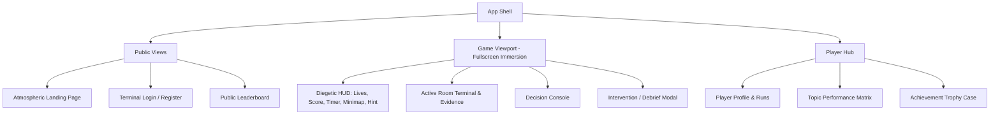
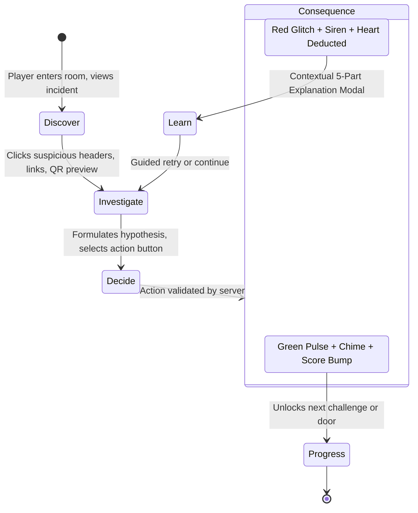

# UX ARCHITECTURE
## Digital Safety Escape Room

---

### 1. UX Philosophy: Game Before Dashboard

Digital Safety Escape Room is designed as an interactive, story-driven cyber facility escape room, **not** an LMS, administrative dashboard, or conventional multiple-choice quiz. 

```
               ┌─────────────────────────────────────────────────────────┐
               │                 TRADITIONAL QUIZ APP                     │
               │   Question Text ──> [A] [B] [C] [D] ──> "Correct! +10"   │
               └─────────────────────────────────────────────────────────┘
                                           VS
               ┌─────────────────────────────────────────────────────────┐
               │               DIGITAL SAFETY ESCAPE ROOM                 │
               │  Locked Terminal ──> Interactive Evidence Inspection    │
               │         ──> Tactical Security Decision                   │
               │         ──> Facility Alarm / Lockdown Reaction           │
               │         ──> 5-Part Contextual Debrief ──> Room Cleared   │
               └─────────────────────────────────────────────────────────┘
```

#### Core UX Tenets
1. **Tangible Investigation**: The player is never asked "Which of the following is phishing?". Instead, the player discovers an active email client, inspects suspicious sender headers, checks TLS certificates, hovers over disguised hyperlinks, and decides whether to quarantine, report, or release the communication.
2. **Consequential Reality**: Decisions carry palpable stakes. Dangerous actions immediately trigger terminal sirens, screen static/glitch distortions, and authoritative life deductions ($\heartsuit \to \heartsuit \heartsuit \heartsuit \text{ break}$).
3. **Painless Micro-Learning**: Education is delivered dynamically as tactical field debriefs rather than academic textbooks.
4. **Diegetic Immersion**: HUD elements, terminals, doors, alerts, and feedback are styled as physical or holographic facility components.

---

### 2. Player Mental Model

The player's mental model is established from the first second:
> *"I am an incident responder trapped inside a cyber-physical security facility that has suffered an active breach. Automated security systems have initiated total facility lockdown. The only way to unlock each bulkhead door is to resolve the cyber threat controlling that sector's terminal."*

This mental model transforms passive learners into active investigators. Evidence is not "quiz content"; it is "live system data."

---

### 3. Emotional Arc & Progression

The UX orchestrates a deliberate emotional journey across each room:

```mermaid
graph LR
    Curiosity[1. Curiosity\nLanding & Facility Lore] --> Tension[2. Tension\nFacility Lockdown & Siren]
    Tension --> Investigation[3. Investigation\nEvidence Examination]
    Investigation --> Decision[4. Decision\nHigh-Stakes Choice]
    Decision --> Consequence[5. Consequence\nAlarm Glitch / Unlock Pulse]
    Consequence --> Learning[6. Learning\n5-Part Tactical Debrief]
    Learning --> Progression[7. Progression\nBulkhead Opening]
    Progression --> Accomplishment[8. Accomplishment\nFacility Escaped & Report]
```



---

### 4. High-Level User Journey

```
[ Public Landing Page ]
         │
         ▼ (CTA: "ENTER FACILITY")
[ Authentication: Terminal Login / Register ]
         │
         ▼
[ Knowledge & Confidence Assessment ] (Phishing, Passwords, QR, Social)
         │
         ▼ (Optional Tutorial Prompt)
[ Facility Entry Cinematic ] (Alarms, Lockdown Protocol Initialized)
         │
         ▼
[ ROOM 01: THE INBOX ] (Phishing & Domain Spoofing)
         │
         ▼
[ ROOM 02: THE VAULT ] (Credential Hygiene & MFA)
         │
         ▼
[ ROOM 03: THE SCANNER ] (Quishing & Destination Inspection)
         │
         ▼
[ ROOM 04: THE MESSAGE ] (Social Engineering & Impersonation)
         │
         ▼
[ ROOM 05: THE CONTROL ROOM ] (Multi-Threat Incident Response)
         │
         ▼
[ FINAL ESCAPE STATE ] (Lockdown Lifted, Facility Secured)
         │
         ├──> [ Cybersecurity Performance Report ]
         ├──> [ Achievement Badges Shelf ]
         └──> [ Global Verified Leaderboard ]
```

---

### 5. Information Architecture & Navigation

The navigation model balances narrative linearity during escape gameplay with accessible utility across persistent pages:



#### Diegetic vs Non-Diegetic Navigation
* During gameplay, generic website navigation (navbar, sidebars, footer) is hidden to preserve maximum immersion.
* A top HUD provides essential operational controls: Emergency Exit (Save & Quit to Dashboard), Audio Toggle, Accessibility/Contrast Toggle, and Help/Hint.

---

### 6. Public Landing Page Experience

* **Visual Atmosphere**: Dark military-grade cyber facility aesthetic (`#0a0d14` slate background with emerald and cyan neon accent vectors, subtle grid scanning lines, pulsing status beacons).
* **Hero Section**: Dramatic typography: *"DIGITAL SAFETY ESCAPE ROOM — BREACH DETECTED"*.
* **Facility Diagnostics Widget**: Interactive preview widget demonstrating an email header inspection directly on the homepage.
* **Primary Call-to-Action**: Pulsing terminal button `[ INITIATE FACILITY ACCESS ]` directing to authentication.

---

### 7. Authentication Experience

* **Form Concept**: Rendered as a secure facility terminal login (`ACCESS CODE INITIALIZATION`).
* **Micro-interactions**: Subtle keypress audio clicks (toggleable), terminal cursor blink, password strength meter integrated as "Entropy Analysis".
* **Feedback**: Authentication errors display as `"ACCESS DENIED: Invalid Security Credentials"` with immediate auto-focus on the invalid field.
* **Guest / Demo Mode**: Clear secondary action `[ GUEST RECON PASS ]` allows quick hackathon evaluation without requiring mandatory email confirmation.

---

### 8. Knowledge Assessment UX

Before entry, the player configures their baseline profile via an interactive security clearance survey:

```
┌────────────────────────────────────────────────────────────────────────┐
│  FACILITY SECURITY CLEARANCE ASSESSMENT                                │
│  Rate your operational confidence across core defense vectors:         │
│                                                                        │
│  1. PHISHING & DOMAIN SPOOFING                                         │
│     [ Recipient ] ──○────────────── [ Expert Investigator ]            │
│                                                                        │
│  2. PASSWORD RESILIENCE & MFA                                          │
│     [ Recipient ] ────────○──────── [ Expert Investigator ]            │
│                                                                        │
│  3. QR CODE INTEGRITY / QUISHING                                       │
│     [ Recipient ] ──○────────────── [ Expert Investigator ]            │
│                                                                        │
│  4. SOCIAL ENGINEERING PRETEXTING                                      │
│     [ Recipient ] ──────────────○── [ Expert Investigator ]            │
│                                                                        │
│  [X] Request Onboarding Protocol (Recommended for Cadets)             │
│                                                                        │
│  [ CONFIRM CLEARANCE & ENTER FACILITY ]                                │
└────────────────────────────────────────────────────────────────────────┘
```

* **Interactive Elements**: Stepped range sliders with descriptive labels rather than bare integers.
* **Purpose Statement**: Clear copy stating: *"Assessment data calibrates tactical guidance sensors during your escape."*

---

### 9. Facility Entry Cinematic

* **Sequence**:
  1. Screen fades to blackout upon confirming assessment.
  2. Red emergency beacon sweeps across screen with muffled siren audio.
  3. Staccato system alerts type out in terminal green:
     * `>> CRITICAL: UNKNOWN INTRUSION IN SECTOR 0`
     * `>> AUTOMATED CONTAINMENT PROTOCOL ACTIVATED`
     * `>> BULKHEAD DOORS 1 THROUGH 5 SEALED`
     * `>> OVERRIDE TERMINAL INITIALIZED: SECTOR 1 (INBOX)`
  4. Camera zooms into Terminal 01 screen.

---

### 10. Game Room Layout & Component Structure

Every room maintains a consistent spatial hierarchy so players never lose situational awareness:

```
┌────────────────────────────────────────────────────────────────────────┐
│ [EXIT]  SECTOR 01: THE INBOX   ♥♥♥   SCORE: 01450   [HINT]   [AUDIO:ON]│  <- HUD
├────────────────────────────────────────┬───────────────────────────────┤
│                                        │ EVIDENCE INSPECTION DOCK      │
│  PRIMARY TERMINAL WORKSPACE            │                               │
│                                        │ [Sender Headers] [v]          │
│  Simulated Interface:                  │ Domain: micr0soft-security.net│
│  - Email Client (Room 1)               │ Return-Path: bounces@bad.ru   │
│  - Vault Auth Panel (Room 2)           │ TLS: Self-Signed Invalid      │
│  - QR Scanner Feed (Room 3)            ├───────────────────────────────┤
│  - Social Chat Terminal (Room 4)       │ TACTICAL DECISION CONSOLE     │
│  - Multi-Threat Matrix (Room 5)        │                               │
│                                        │ [ QUARANTINE & REPORT ] (Red) │
│  (Interactive elements highlighted)    │ [ MARK AS SAFE ]       (Grey) │
│                                        │ [ REQUEST OUT-OF-BAND ] (Blue)│
└────────────────────────────────────────┴───────────────────────────────┘
```

---

### 11. Challenge Interaction Cycle: Discover $\to$ Investigate $\to$ Decide



---

### 12. Investigation Interaction Patterns

* **Inspectable Links**: Hovering or focusing a hyperlink displays a safe simulated URL Inspector tooltip revealing the actual destination hostname, protocol, and redirect chain (never opening external browser tabs).
* **Header Toggle**: An expandable `[VIEW RAW HEADERS]` badge reveals `Received-SPF`, `DKIM-Signature`, and `Authentication-Results`.
* **QR Decoder Lens**: Hovering the target QR code renders an augmented HUD overlay showing decoded URI, SSL certificate issuer, and domain registration age.
* **Identity Verifier**: In Room 04, a simulated directory lookup lets players cross-check caller IDs against official internal security directories.

---

### 13. Decision Interaction UX

* **Intentional Commitment**: Critical actions require explicit double-click or confirmation to prevent accidental misclicks (e.g., clicking `[EXECUTE PAYLOAD]` triggers a 1-second hold-to-confirm ring).
* **Action Types**:
  * Neutral/Defensive: `[QUARANTINE MESSAGE]`, `[REPORT PHISHING]`, `[BLOCK ORIGIN]`.
  * Risky/Compliant: `[APPROVE CREDENTIAL]`, `[DOWNLOAD ATTACHMENT]`, `[PROVIDE OTP]`.
  * Investigative: `[INITIATE OUT-OF-BAND VERIFICATION]`.

---

### 14. Correct-State UX

When the player selects the correct security defense:
* **Audio-Visual Feedback**: A clean, crisp sonic confirmation chime sounds.
* **Terminal Update**: The interface flashes emerald green (`#10b981`), displaying `DECISION VERIFIED: THREAT NEUTRALIZED`.
* **Score Animation**: Floating $+500$ points increment animates upward into the HUD score counter.
* **Progression Indicator**: The room challenge progress pip fills with a vibrant green glow.

---

### 15. Wrong-State UX

When an unsafe action is committed:
* **Audio-Visual Feedback**: A low-frequency alarm buzzer sounds; the viewport undergoes a brief, controlled chromatic aberration / glitch vibration (respecting reduced motion settings).
* **Life Deduction**: One heart icon in the HUD undergoes a cracking and shatter animation:
  $$\heartsuit \heartsuit \heartsuit \longrightarrow \heartsuit \heartsuit \heartsuit_{\text{shattered}} \longrightarrow \heartsuit \heartsuit \heartsuit_{\text{empty}}$$
* **Intervention Transition**: Gameplay instantly pauses, dimming background terminals, and mounts the **5-Part Tactical Debrief Modal**.

---

### 16. Explanation UX: The 5-Part Framework

The debrief modal is formatted for rapid cognitive retention without intimidating blocks of text:

```
┌────────────────────────────────────────────────────────────────────────┐
│ [!] SECURITY INCIDENT DEBRIEF — CRITICAL MISSTEP                       │
├────────────────────────────────────────────────────────────────────────┤
│ 1. WHAT HAPPENED                                                       │
│    You clicked the password reset link inside the unverified email.    │
│                                                                        │
│ 2. EVIDENCE REVEALED                                                   │
│    Sender domain was "micr0soft-security.net" (Typosquatted numeral 0).│
│    Target hyperlink led to "http://185.220.101.4/login.php".          │
│                                                                        │
│ 3. WHY IT WAS DANGEROUS                                                │
│    Credential harvesting portal would capture your admin credentials   │
│    and grant root access to facility subnets.                          │
│                                                                        │
│ 4. CORRECT ACTION                                                      │
│    Quarantine the email and report to Security Operations (SOC).       │
│                                                                        │
│ 5. PRACTICAL SECURITY TIP                                              │
│    Always inspect the root domain after the '@' sign and navigate      │
│    directly to bookmarked official portals rather than email links.    │
├────────────────────────────────────────────────────────────────────────┤
│ [ UNDERSTOOD — RESUME INVESTIGATION ]                                  │
└────────────────────────────────────────────────────────────────────────┘
```

---

### 17. Tutorial UX & Adaptive Micro-Learning

* **Introductory Tutorial (Optional)**: If requested in the assessment, Room 01 begins with a non-intrusive interactive spotlight walking through the terminal UI (pointing out headers, links, and action buttons).
* **Level 3 Micro-Tutorial**: If a player commits two consecutive errors on a specific topic (e.g., QR manipulation), a slide-out drawer provides a 30-second diagrammatic breakdown of that specific attack vector before returning to gameplay.

---

### 18. Hint UX

* **Accessibility**: A prominent `[ REQUEST HINT ]` button is available in the top HUD.
* **Tradeoff Transparency**: Clicking Hint opens a modal stating:
  > *"Consulting Facility Intelligence will deduct 75 points from your sector score. Proceed?"*
* **Progressive Hinting**:
  * Tier 1 Clue: Directs attention to an evidence area (e.g., *"Inspect the sender's return path carefully"*).
  * Tier 2 Clue: Explicitly highlights the anomaly (e.g., *"The domain contains an anomalous numeral"*).

---

### 19. Lives UX & Game Over

* **HUD Hearts**: Displayed prominently in the header center ($\heartsuit \heartsuit \heartsuit$).
* **Low Health State**: When reduced to 1 life ($\heartsuit \heartsuit \heartsuit$), the remaining heart pulses with a gentle red heartbeat animation, and ambient audio adds a subtle distant siren.
* **Game Over (Facility Breach)**:
  * Bulkhead doors seal shut with hydraulic sound effects.
  * Screen displays: `"CONTAINMENT BREACH: FACILITY PERMANENTLY COMPROMISED"`.
  * Options: `[ RE-ENTER SECTOR ]` (Restart current room with refreshed 3 lives) or `[ RETURN TO DASHBOARD ]`.

---

### 20. Score UX

* **Counter**: Monospaced tabular digits (`01450`) that rapidly count up when points are awarded.
* **Score Breakdown Toast**: At the end of each sector, a temporary overlay reveals:
  * Base Room Points: $+1500$
  * Speed Bonus: $+120$
  * Hint Deductions: $-75$
  * Net Sector Total: $+1545$

---

### 21. Progress UX: Sector Minimap

A sleek horizontal breadcrumb tracker in the HUD shows facility layout:

```
[01: INBOX] ──✔── [02: VAULT] ──✔── [03: SCANNER] ──► [04: MESSAGE] ──🔒── [05: CONTROL]
```
* **Cleared**: Glowing cyan with checkmark.
* **Active**: Pulsing amber/cyan cursor.
* **Locked**: Dim slate with padlock icon.

---

### 22. Room Transitions

* Upon completing the final challenge of Room $N$:
  1. A hydraulic hiss sound effect plays.
  2. The screen displays a transition animation of double pneumatic blast doors sliding open.
  3. A brief narrative bridge appears:
     > *"Sector 01 cleared. Accessing Sector 02: High-Security Credential Vault..."*
  4. The next room's terminal workspace smoothly transitions into view.

---

### 23. Final Escape Experience

Completing Room 05 (The Control Room) triggers the climactic victory sequence:
* **Lockdown Lifted**: The red emergency lighting throughout the facility transitions into clean daylight white and green illumination.
* **Audio Climax**: Emergency klaxons cut off, replaced by ambient atmospheric synthesizer chords.
* **Victory Headline**: Large cinematic title:
  > **FACILITY SECURED — ESCAPE SUCCESSFUL**
  > *All 5 Sectors Contained | Incident Neutralized*
* Seamless transition to the **Cybersecurity Performance Report**.

---

### 24. Cybersecurity Performance Report UX

The report is the primary educational deliverable, transforming the game into an actionable personal diagnostic:

```
┌────────────────────────────────────────────────────────────────────────┐
│  CYBERSECURITY OPERATIONAL PERFORMANCE REPORT                          │
│  Agent: Cadet-942    Time: 14m 32s    Score: 8,450    Lives Left: ♥♥   │
├────────────────────────────────────────────────────────────────────────┤
│  TOPIC MASTERY BREAKDOWN                                               │
│                                                                        │
│  Phishing Detection         [██████████████████░░]  92% (Exemplary)    │
│  Password & MFA Hygiene     [███████████████░░░░░]  78% (Proficient)   │
│  QR / Quishing Security     [█████████████████░░░]  86% (Proficient)   │
│  Social Engineering Shield  [████████████░░░░░░░░]  64% (Vulnerable)   │
├────────────────────────────────────────────────────────────────────────┤
│  STRONGEST SECURITY CAPABILITY                                         │
│  ★ Phishing Header & Typosquatting Recognition                         │
│                                                                        │
│  PRIMARY VULNERABILITY REQUIRING REMEDIATION                           │
│  ▲ Social Engineering: Susceptibility to Urgency and Authority Pretext │
│                                                                        │
│  PERSONALIZED ACTIONABLE PROTOCOL                                      │
│  "Whenever a superior requests immediate OTPs or credential bypasses,  │
│   always pause and verify via a known out-of-band communication line." │
├────────────────────────────────────────────────────────────────────────┤
│  [ DOWNLOAD REPORT PDF ]    [ VIEW LEADERBOARD ]    [ RETURN TO HUB ]  │
└────────────────────────────────────────────────────────────────────────┘
```

---

### 25. Achievement Experience & Badges

Badges unlock with a celebratory holographic banner slide-in:
* **Cyber Guardian**: Awarded for successfully completing the entire facility.
* **Phishing Expert**: $>90\%$ accuracy in Room 01 with 0 lives lost.
* **QR Detective**: Identified all malicious QR redirections without using hints.
* **Secure Authenticator**: Flawlessly configured vault passwords and MFA.
* **Social Engineering Shield**: Refused all impersonation and urgency baits.
* **Zero Mistake Escape**: Escaped the entire facility with all 3 lives intact.

---

### 26. Player Dashboard UX

* Secondary to escape gameplay, accessed when returning to the application.
* **Features**:
  * Active Playthrough card with prominent `[ CONTINUE ESCAPE ]` CTA.
  * Career Escape History table (Date, Score, Time, Topics, Status).
  * Radar Chart of cumulative skill competencies over time.
  * Trophy Case displaying unlocked vs locked holographic badge silhouettes.

---

### 27. Leaderboard UX

* **Structure**: Clean, legible, high-contrast table of verified facility escapes.
* **Columns**: Rank (#1, #2, etc.), Agent Username, Final Score, Time Elapsed, Accuracy %, Badges Earned.
* **Integrity Badge**: Every entry displays a small verified shield icon indicating server-side cryptographic audit.
* **Filters**: `All-Time Top Escapes` and `Weekly Tactical Sprint`.

---

### 28. Error States

* **Lost Connectivity**: Non-blocking amber banner at top of viewport: *"Telemetry connection interrupted. Reconnecting to facility host..."* with automatic reconnection retries.
* **Session Expired**: Clean modal: *"Security session expired. Re-authenticate to resume Sector 03"* preserving local inputs.

---

### 29. Empty States

* **New Player Dashboard**: Terminal prompt graphic: *"No operational missions logged. Initiate Facility Access to begin your first escape run."*
* **Unearned Badges**: Outlined translucent blueprint icons with clear unlock prerequisites on hover.

---

### 30. Loading States

* Instead of generic spinning circles, loading states display diegetic terminal diagnostics:
  * *"Decrypting Sector 02 access logs..."*
  * Scanline progress bars with subtle green glow.
  * Wireframe skeleton terminal boxes that preserve UI layout stability.

---

### 31. Accessibility (a11y) Standards

* **WCAG 2.1 AA Compliance**:
  * Minimum color contrast ratio of $4.5:1$ for normal text and $3:1$ for large text against dark terminal backgrounds.
  * Full keyboard navigability: Every inspectable element, header toggle, and decision button has distinct `:focus-visible` rings (high-contrast cyan outline).
  * Screen Reader Support: ARIA live regions announce life reductions (`aria-live="assertive"`), score updates, and newly mounted investigation drawers.

---

### 32. Responsive & Mobile UX

* **Desktop ($\ge 1024$px)**: Side-by-side terminal workspace and decision dock.
* **Tablet & Mobile ($< 1024$px)**:
  * Workspace occupies primary viewport.
  * Decision dock collapses into an anchored, bottom-sheet drawer with a swipeable drag handle and quick action toggles.
  * All interactive touch targets are strictly sized $\ge 44 \times 44$px.

---

### 33. Reduced-Motion Considerations

Honors user system setting (`@media (prefers-reduced-motion: reduce)`):
* Screen vibration and glitch distortion effects are completely disabled.
* Red alarm flash is replaced with a gentle, static border color change.
* Sliding bulkhead doors use instantaneous opacity fades instead of rapid geometric motion.
